# EDCOCR Architecture

This document is the canonical top-level architecture reference for EDCOCR. Read it first if you are evaluating, integrating, or extending the platform.

For deeper-dive material, see [`docs/00-SYSTEM-BLUEPRINT.md`](docs/00-SYSTEM-BLUEPRINT.md) (system blueprint) and [`docs/03-INFORMATION-FLOWS.md`](docs/03-INFORMATION-FLOWS.md) (information flows).

---

## Table of Contents

1. [Design Principles](#1-design-principles)
2. [System Overview](#2-system-overview)
3. [Pipeline Architecture](#3-pipeline-architecture)
4. [Deployment Topologies](#4-deployment-topologies)
5. [Data Model](#5-data-model)
6. [Storage Architecture](#6-storage-architecture)
7. [Observability](#7-observability)
8. [Security Architecture](#8-security-architecture)
9. [Chain of Custody](#9-chain-of-custody)
10. [Failure Modes](#10-failure-modes)

---

## 1. Design Principles

EDCOCR's architecture is shaped by five non-negotiables:

| Principle | What It Means In Practice |
|---|---|
| **Zero hallucination** | CTC-only recognition. Generative AI never touches the recognition path. If it generates a character that wasn't there, it's not OCR — it's storytelling. |
| **Preserve the evidence** | OCR failure never deletes the source. A blank-text page falls back to image-only embedding, and a custody event records why. |
| **Deterministic recovery** | Page-level temp files mean the pipeline can crash anywhere and resume without rework. No "lost half a batch." |
| **Tamper-evident by construction** | SHA-256 hash-chained JSONL custody log. Append-only, replayable, signature-verifiable. |
| **Operable at any size** | Same code path from a laptop Docker run to a multi-cluster Kubernetes federation. |

These principles are load-bearing. Most architectural choices below are direct consequences of one or more of them.

---

## 2. System Overview

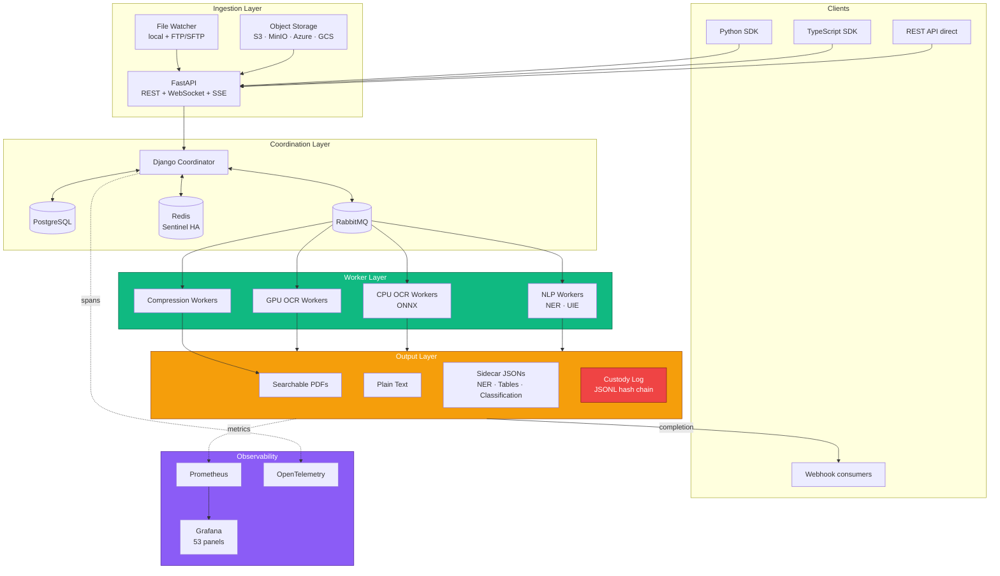

### Component Roles

| Layer | Component | Responsibility |
|---|---|---|
| **Ingestion** | FastAPI | Accept jobs via REST/WebSocket, authenticate, validate, rate-limit, route. |
| | File Watcher | Poll mounted directories or FTP/SFTP shares for new documents. |
| | Object Storage | Stage documents from S3/MinIO/Azure/GCS via presigned URLs. |
| **Coordination** | Django Coordinator | Job lifecycle, worker registry, capability routing, admin UI. |
| | PostgreSQL | Durable storage for jobs, pages, custody events, tenants. |
| | RabbitMQ | Task queue with capability-based routing (`ocr_gpu_*`, `ocr_cpu`, `nlp`, etc.). |
| | Redis (+ Sentinel) | Job state cache, Celery result backend, rate-limit counters, Redis Streams for context windowing. |
| **Workers** | GPU OCR | PaddleOCR + Tesseract fallback + optional Document Intelligence. |
| | CPU OCR | ONNX Runtime / OpenVINO backend for CPU-only deployments. |
| | NLP | spaCy NER, PaddleNLP UIE, classification ensemble. |
| | Compression | Ghostscript optimization with integrity validation. |
| **Output** | Searchable PDFs | OCR text layer embedded in original PDF. |
| | Sidecar JSONs | One file per enrichment (NER, structure, classification, etc.). |
| | Custody Log | Hash-chained JSONL audit trail. |

---

## 3. Pipeline Architecture

The OCR pipeline is a **6-stage async producer-consumer model** with 31 threads.

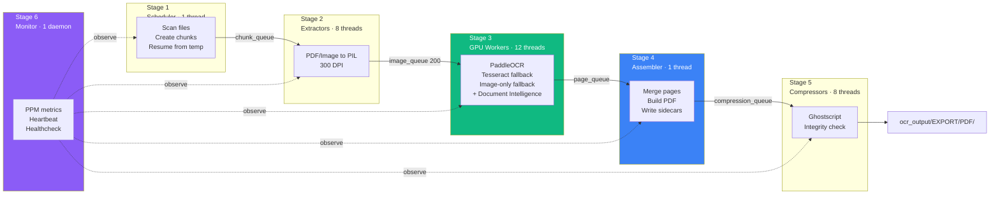

### Thread Counts and Queues

| Stage | Threads | Queue Size | Purpose |
|---|---|---|---|
| Scheduler | 1 | — | File enumeration, chunk task creation |
| Extractors | 8 | 50 (chunk) | CPU-bound PDF/image to 300 DPI PIL conversion |
| GPU Workers | 12 | 200 (image) | OCR recognition + optional layout/table analysis |
| Assembler | 1 | — (registry) | Merge pages, write outputs, emit custody events |
| Compressors | 8 | — (FIFO) | Ghostscript optimization with integrity validation |
| Monitor | 1 daemon | — | Real-time metrics, heartbeat, healthcheck |

Thread counts are tunable via environment variables. See [`docs/06-CONFIGURATION-REFERENCE.md`](docs/06-CONFIGURATION-REFERENCE.md).

### Page Lifecycle

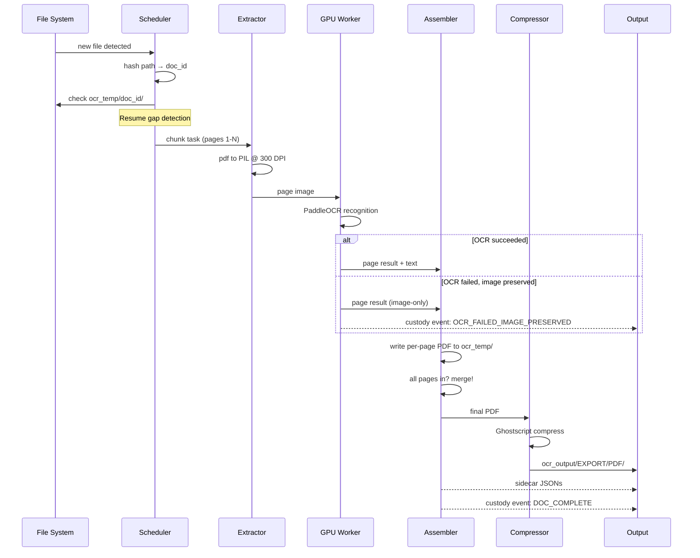

### Resume Semantics


`compute_resume_gap_chunks(total_pages, existing_pages, chunk_target_size)` is the canonical helper. It uses explicit set difference and is covered by 34 regression tests in `tests/test_gap_detection.py`.

---

## 4. Deployment Topologies

EDCOCR supports four deployment patterns. Same code, different orchestration.

### 4.1 Single-Host Docker (Development & Small Production)

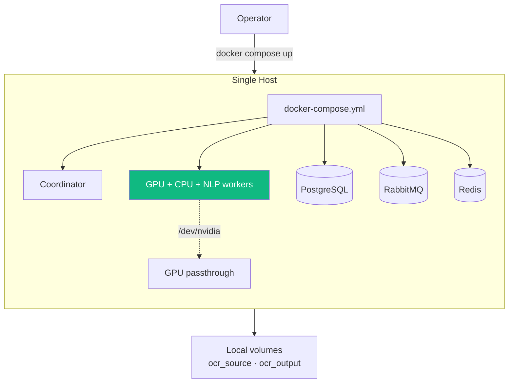

**When to use:** Development, single-tenant on-premises, processing volumes under ~50k pages/day.

### 4.2 Distributed Coordinator + Worker Fleet

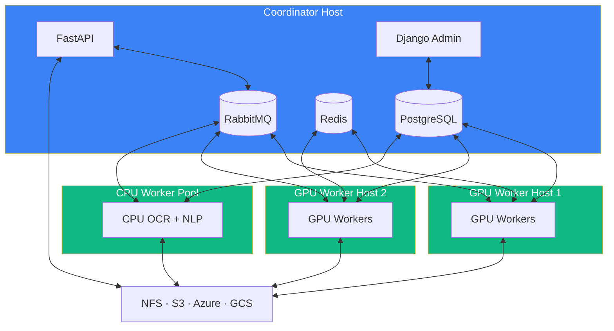

**When to use:** Mid-volume production, mixed GPU+CPU fleet, single-region deployment.

### 4.3 Kubernetes (KEDA Autoscaled)

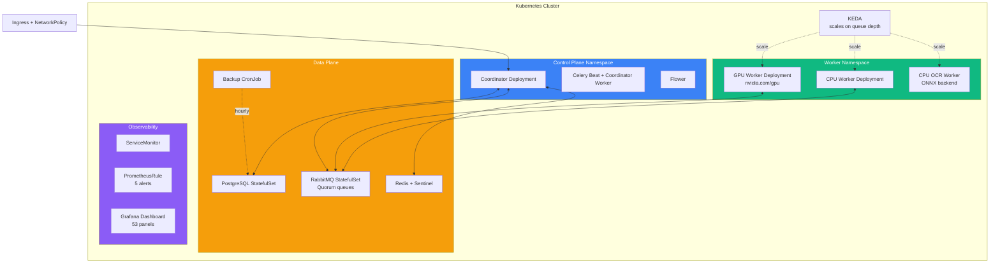

**When to use:** Production at scale, multi-tenant, autoscaling demand, formal HA requirements.

The Helm chart ships 26 templates covering everything above plus PDBs, NetworkPolicies, Ingress, Secrets, ConfigMaps, and KEDA ScaledObjects.

### 4.4 Air-Gapped Deployment

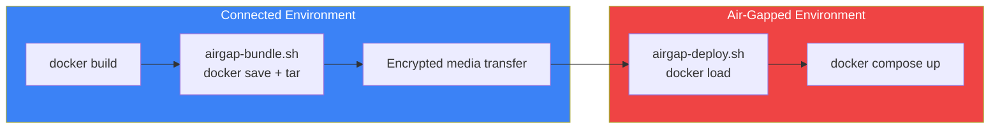

All 45 language models, FastText detector, spaCy models, and ML weights are baked into the Docker image. The runtime never requires outbound network access.

---

## 5. Data Model

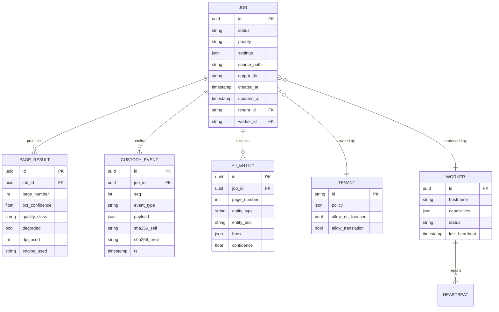

### Hash Chain Detail

Each `CUSTODY_EVENT` carries:

- `sha256_self` — hash of `(prev_hash || event_type || payload || ts)`
- `sha256_prev` — `sha256_self` from the preceding event in the same job

Verifying integrity is a linear walk: recompute each hash, confirm continuity, confirm signatures (if signing is enabled). Any tampering — insertion, deletion, edit — breaks the chain at the point of tampering.

---

## 6. Storage Architecture

EDCOCR supports two storage backends concurrently:

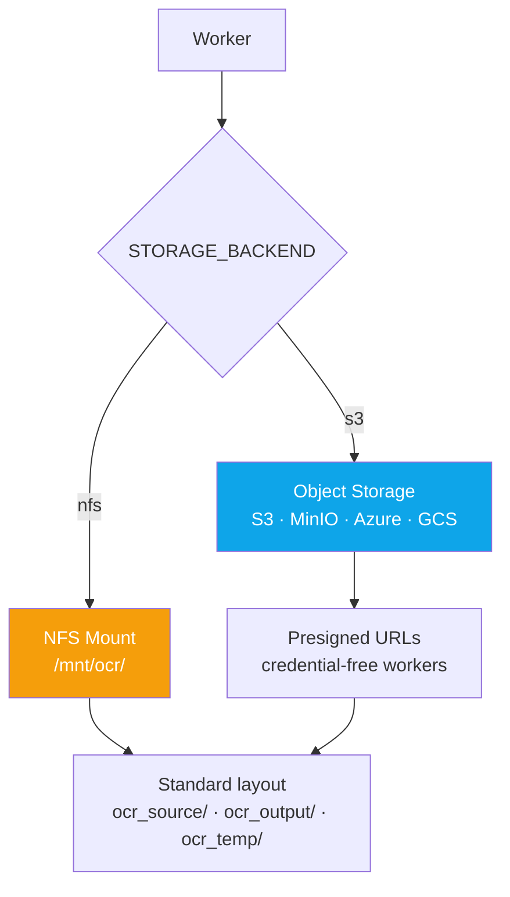

| Backend | Pros | Cons |
|---|---|---|
| **NFS** | Simple, POSIX semantics, no auth complexity | Single mount point bottleneck, harder for multi-region |
| **S3-compatible** | Multi-region, credential-free workers via presigned URLs, scale-out | Eventual consistency for some operations, costs scale with API calls |

### Migration

`scripts/migrate_nfs_to_s3.py` performs SHA-256-verified bulk migration with resume support. See [`docs/operations/`](docs/operations/) for the runbook.

---

## 7. Observability

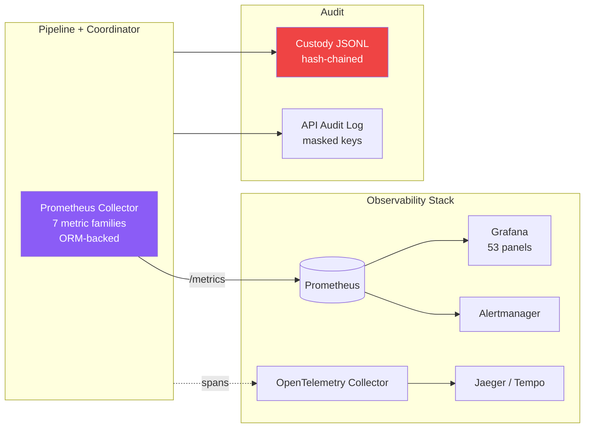

### Metric Families

| Family | Examples |
|---|---|
| **Throughput** | `ocr_pages_processed`, `ocr_documents_completed` |
| **Latency** | `ocr_job_duration_seconds`, `ocr_page_duration_seconds` |
| **Queue** | `ocr_queue_depth`, `ocr_queue_lag_seconds` |
| **GPU** | `ocr_gpu_vram_bytes`, `ocr_gpu_utilization_percent` |
| **Cost** | `ocr_cost_estimate_total` (per tenant) |
| **SLA** | `ocr_sla_uptime_ratio`, `ocr_sla_throughput_compliance` |
| **Errors** | `ocr_job_failures_total`, `ocr_custody_chain_breaks_total` |

### Alert Rules

Five PrometheusRule alerts ship in the Helm chart:

1. `OCRQueueBackup` — sustained queue depth above threshold
2. `OCRWorkerDown` — heartbeat gap exceeds tolerance
3. `OCRJobFailureSpike` — failure ratio above baseline
4. `OCRSLABreached` — per-tenant SLA below contract
5. `OCRCustodyChainBreak` — hash chain integrity violation

---

## 8. Security Architecture

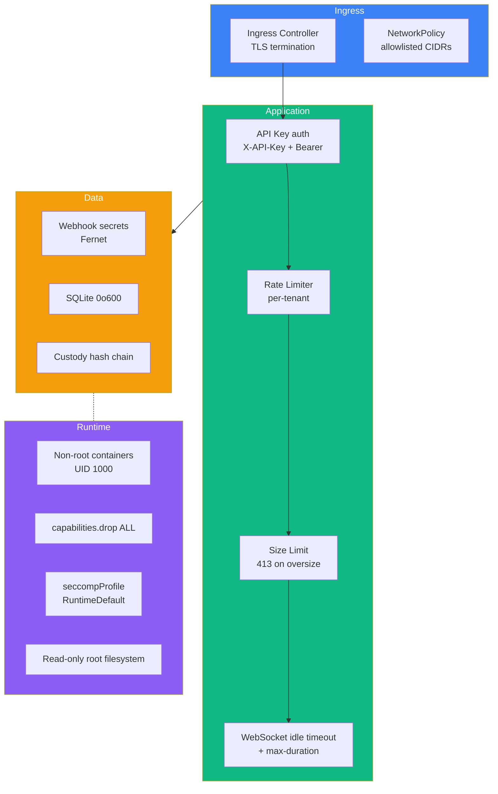

### Defense in Depth

| Layer | Control |
|---|---|
| **Network** | Ingress allowlist, NetworkPolicy, mTLS option for worker-coordinator |
| **Auth** | API key (X-API-Key or Bearer), 1024-byte timing-safe comparison |
| **Input** | Pydantic validation, 413 on oversize body, content-type checking |
| **Rate limiting** | Per-tenant, configurable via TenantPolicy |
| **WebSocket** | Idle timeout, max duration, payload size limit |
| **Storage** | SQLite 0o600 permissions, S3 cache 0o700 |
| **Secrets** | Webhook secrets encrypted with Fernet (WEBHOOK_SECRET_KEY) |
| **Runtime** | Non-root containers, dropped capabilities, seccomp profile |
| **Audit** | Hash-chained custody log, masked API key in audit middleware |
| **Tenant isolation** | Conditional `tenant_id` filter on all tenant-scoped endpoints |

---

## 9. Chain of Custody

The custody log is **the** forensic primitive. Every operation that touches a document or its derived artifacts emits an event.

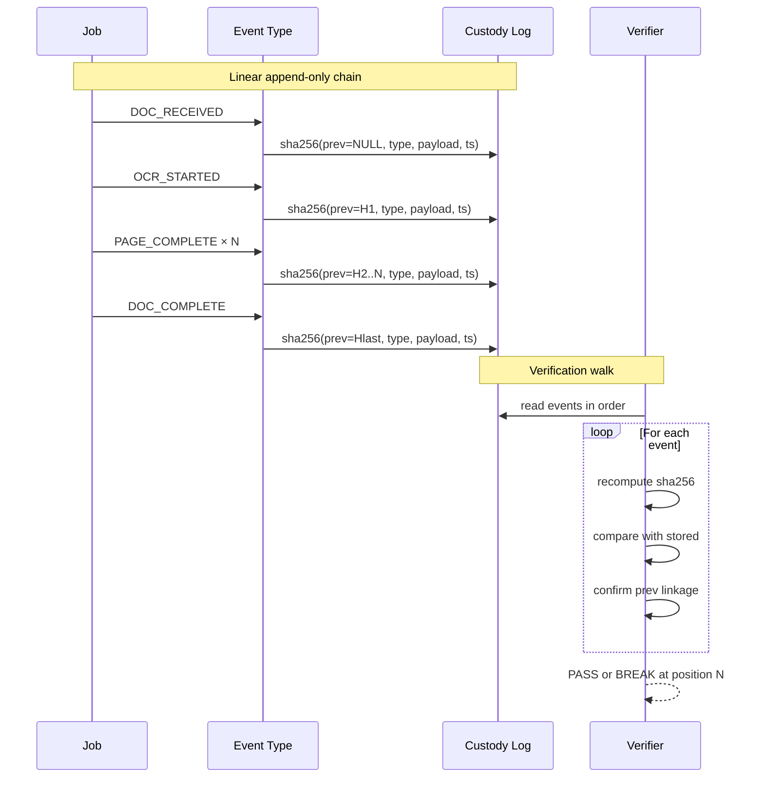

### Event Types

| Category | Events |
|---|---|
| **Lifecycle** | `DOC_RECEIVED`, `DOC_STARTED`, `DOC_COMPLETE`, `DOC_FAILED` |
| **Page-level** | `PAGE_OCR_START`, `PAGE_OCR_COMPLETE`, `OCR_FAILED_IMAGE_PRESERVED` |
| **Configuration** | `CONFIG_APPLIED`, `MODEL_LOAD_NC_LICENSE_ACKNOWLEDGED` |
| **Language** | `LANGUAGE_DETECTED`, `LANGUAGE_MIXED_SCRIPT`, `LANGUAGE_REDETECTED` |
| **Translation** | `TRANSLATION_REQUESTED`, `TRANSLATION_REJECTED`, `GENERATIVE_TRANSLATION_USED` |
| **Review** | `REVIEW_QUEUE_ENTERED`, `REVIEW_CERTIFIED`, `REVIEW_REJECTED` |
| **Output** | `OUTPUT_WRITTEN`, `OUTPUT_VERIFIED`, `OUTPUT_DELIVERED` |

### Verification

```bash
python scripts/verify_release_state.py --custody-log ocr_output/custody.jsonl
```

The verifier walks the chain, recomputes every hash, validates signatures (if signing is enabled), and reports the exact position of any break.

---

## 10. Failure Modes

EDCOCR is designed to fail visibly and recoverably, not silently.

```mermaid
flowchart TB
    Fail{Failure}
    Fail -->|Worker crash mid-job| Resume[Page-level resume<br/>continue from missing chunks]
    Fail -->|GPU OOM| Backoff[Adaptive batch sizing<br/>retry at smaller batch]
    Fail -->|OCR confidence low| DPI[DPI escalation<br/>retry at 450 then 600]
    Fail -->|OCR returns nothing| Preserve[Image-only embedding<br/>custody event]
    Fail -->|Ghostscript fails| Skip[Skip compression<br/>keep uncompressed]
    Fail -->|Queue depth exceeded| Reject[413 at API<br/>client retries with backoff]
    Fail -->|Subprocess timeout| Kill[Kill subprocess<br/>page enters failure pipeline]
    Fail -->|RabbitMQ down| Quorum[Quorum queues<br/>survive minority loss]
    Fail -->|PostgreSQL down| BackupJob[Backup CronJob<br/>restore from last hour]
    Fail -->|Redis down| Sentinel[Sentinel failover<br/>promote replica]
    Fail -->|Custody chain break| Alert[Prometheus alert<br/>fire immediately]

    style Resume fill:#10b981,color:#fff
    style Preserve fill:#10b981,color:#fff
    style Alert fill:#ef4444,color:#fff
```

### Subprocess Timeouts

External processes have enforced timeouts at module-level constants:

| Process | Timeout |
|---|---|
| Ghostscript | 300s (`GS_TIMEOUT`) |
| Tesseract | 120s (`TESSERACT_TIMEOUT`) |
| Poppler | 300s (`POPPLER_TIMEOUT`) |

On timeout, the subprocess is killed and the page/document enters the failure pipeline. No silent hangs.

---

## Further Reading

- [`docs/00-SYSTEM-BLUEPRINT.md`](docs/00-SYSTEM-BLUEPRINT.md) — Deeper system blueprint
- [`docs/03-INFORMATION-FLOWS.md`](docs/03-INFORMATION-FLOWS.md) — Information flow diagrams
- [`docs/06-CONFIGURATION-REFERENCE.md`](docs/06-CONFIGURATION-REFERENCE.md) — Every env var
- [`docs/FAILOVER-RUNBOOK.md`](docs/FAILOVER-RUNBOOK.md) — HA failover procedures
- [`docs/10-MONITORING-OPERATIONS.md`](docs/10-MONITORING-OPERATIONS.md) — Operating in production
- [`docs/security-audit-checklist.md`](docs/security-audit-checklist.md) — Security review
