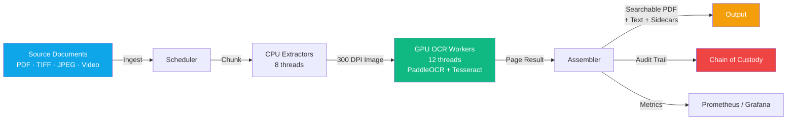
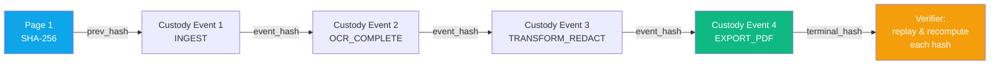
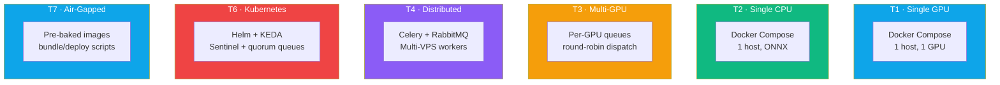

<div align="center">

# EDCOCR

### Forensic-Grade OCR Platform for Electronic Discovery &amp; Document Processing

[](LICENSE)
[](CHANGELOG.md)
[](https://www.python.org/)
[](https://www.docker.com/)
[](https://kubernetes.io/)
[](https://github.com/PaddlePaddle/PaddleOCR)
[](https://fastapi.tiangolo.com/)
[](https://www.djangoproject.com/)

#### Zero-hallucination OCR &middot; 45 languages &middot; GPU + CPU &middot; Chain of custody &middot; Distributed at scale

[**Quick Start**](#-quick-start) &nbsp;&middot;&nbsp; [**Executive Summary**](presentation/executive-summary.html) &nbsp;&middot;&nbsp; [**Technical Brief**](presentation/technical-brief.html) &nbsp;&middot;&nbsp; [**White Paper**](presentation/white-paper.html) &nbsp;&middot;&nbsp; [**Use Cases**](presentation/use-cases.html)

[Documentation](docs/) &nbsp;&middot;&nbsp; [Architecture](ARCHITECTURE.md) &nbsp;&middot;&nbsp; [API Reference](docs/API-REFERENCE.md) &nbsp;&middot;&nbsp; [Live Demo](presentation/index.html)

</div>

---

<div align="center">

### Most OCR tools were built for digitizing brochures.<br>EDCOCR was built for the day someone asks <em>"where did this text come from, and can you prove it?"</em>

</div>

---

## At a Glance

<table>
  <tr>
    <td align="center" width="16%">
      <b><sub>RECOGNITION</sub></b><br>
      <b style="font-size:1.5em">45</b><br>
      <sub>Languages, 2 tiers</sub>
    </td>
    <td align="center" width="16%">
      <b><sub>PIPELINE</sub></b><br>
      <b style="font-size:1.5em">31</b><br>
      <sub>Concurrent threads</sub>
    </td>
    <td align="center" width="16%">
      <b><sub>OUTPUTS</sub></b><br>
      <b style="font-size:1.5em">14</b><br>
      <sub>Sidecar schemas</sub>
    </td>
    <td align="center" width="16%">
      <b><sub>TOPOLOGIES</sub></b><br>
      <b style="font-size:1.5em">7</b><br>
      <sub>T1 single-host &rarr; T7 air-gap</sub>
    </td>
    <td align="center" width="16%">
      <b><sub>HELM</sub></b><br>
      <b style="font-size:1.5em">26</b><br>
      <sub>K8s templates</sub>
    </td>
    <td align="center" width="16%">
      <b><sub>OUTBOUND</sub></b><br>
      <b style="font-size:1.5em">0</b><br>
      <sub>Calls (air-gap ready)</sub>
    </td>
  </tr>
</table>

---

## What Is EDCOCR?

EDCOCR is a production-grade Optical Character Recognition platform purpose-built for **forensic, legal, and high-volume document processing**. It turns scans, PDFs, images, and videos into searchable, auditable outputs &mdash; without the hallucinations, drift, or evidence loss that come with generative-AI OCR.

It is the work product of years of pipeline iteration. Every design decision tilts toward one outcome: **a usable, defensible document at the end of the pipeline, even when the inputs are awful.**



---

## Presentation Suite

Four self-contained briefings live under [`presentation/`](presentation/). Open any HTML file in a browser &mdash; no build step, no server, no analytics.

<table>
  <tr>
    <td width="25%" align="center">
      <a href="presentation/executive-summary.html"><b>Executive Summary</b></a><br>
      <sub>For decision-makers</sub><br><br>
      The one-pager explaining why a forensic-grade OCR platform exists and what it costs to ignore the difference.<br><br>
      <sub>~5 min &middot; Legal, compliance, ops leadership</sub>
    </td>
    <td width="25%" align="center">
      <a href="presentation/technical-brief.html"><b>Technical Brief</b></a><br>
      <sub>For engineers</sub><br><br>
      Pipeline internals, deployment topologies, API surface, SDK examples, observability stack, security posture.<br><br>
      <sub>~15 min &middot; Integrators, SRE, platform</sub>
    </td>
    <td width="25%" align="center">
      <a href="presentation/white-paper.html"><b>White Paper</b></a><br>
      <sub>For evaluators</sub><br><br>
      Twelve sections covering motivation, design principles, output schema, translation policy, and admissibility posture.<br><br>
      <sub>~25 min &middot; Architects, evaluators, counsel</sub>
    </td>
    <td width="25%" align="center">
      <a href="presentation/use-cases.html"><b>Use Cases</b></a><br>
      <sub>For product / legal</sub><br><br>
      Seven worked scenarios with recommended topology, feature flags, and operational outcome &mdash; plus where EDCOCR is <em>not</em> a fit.<br><br>
      <sub>~10 min &middot; Product, legal, sales engineering</sub>
    </td>
  </tr>
</table>

Plus three interactive decks: [`presentation/index.html`](presentation/index.html) (marketing landing) &middot; [`presentation/slides.html`](presentation/slides.html) (keyboard-navigable slides) &middot; [`presentation/architecture.html`](presentation/architecture.html) (architecture deep-dive).

---

## Why Forensic-Grade?

| Concern | How EDCOCR Handles It |
|---|---|
| **Hallucinations** | CTC-only recognition (PaddleOCR). No generative model anywhere in the recognition path. |
| **Lost evidence** | OCR failure never discards the source image. Failed pages survive into the output PDF as image-only pages with an audit entry. |
| **Crash recovery** | Page-level temp files with deterministic resume. Kill the process mid-job, restart, no rework. |
| **Tamper detection** | SHA-256 hash-chained JSONL custody log. Append-only, replayable, signature-verifiable. |
| **Chain of custody** | Every document, every page, every transformation gets a custody event. Filesystem path, hash, processor identity. |
| **Language drift** | Two-pass adaptive detection (FastText) with per-span BCP-47 sidecar (opt-in). |
| **Mixed scripts** | Language re-detection without re-running OCR. |
| **Privileged content** | Privilege detection during structured extraction; soft-warning posture and policy-enforced redaction. |

### How the Custody Chain Works



Each event in [`custody.py`](custody.py) writes a JSONL record whose `event_hash` is `SHA-256(prev_hash || canonical_event_json)`. Tampering with any record in the chain invalidates every record after it. The chain is append-only and replayable by anyone who has the file.

---

## EDCOCR vs the Alternatives

| | EDCOCR | Generative-AI OCR | Open-Source CTC Toolkits |
|---|---|---|---|
| **Recognition model** | CTC (PaddleOCR 2.9.1) | LLM-decoded | CTC, varies |
| **Hallucination risk** | None by design | Documented and material | None by design |
| **Audit trail** | Hash-chained JSONL custody | None standard | None standard |
| **Crash resume** | Page-level deterministic | Job-level at best | Manual |
| **Air-gap deployable** | Yes &mdash; pre-baked models | No (calls external APIs) | Yes, but you build it |
| **Distributed at scale** | Helm chart + KEDA + Celery | Hosted only | DIY |
| **Forensic preservation** | Image-only fallback embedded | Returns "error" | Returns "error" |
| **Per-tenant isolation** | Built in | Hosted account boundary | DIY |
| **License** | Apache 2.0 | Proprietary | Mixed |
| **Operational maturity** | 9,000+ unit tests, 53 Grafana panels | Black box | Varies |

> &mdash; The forensic-vs-AI boundary is enforced in code: see [`docs/architecture/forensic-ai-boundary-contract.md`](docs/architecture/forensic-ai-boundary-contract.md) and [`scripts/validate_feature_boundary.py`](scripts/validate_feature_boundary.py).

---

## Core Capabilities

### Recognition
- **45 languages** in a tiered registry (34 core + 11 extended)
- **CTC-only recognition** &mdash; no hallucinations possible by design
- **Adaptive DPI escalation** &mdash; auto-retry low-confidence pages at 450/600 DPI
- **Image preprocessing** &mdash; OpenCV-based deskew, denoise, binarize for degraded scans
- **Smart engine selection** &mdash; quality-based routing between Tesseract and PaddleOCR
- **CJK vertical text** &mdash; reading-order analysis for vertical Chinese, Japanese, Korean

### Pipeline
- **6 concurrent stages, 31 threads** &mdash; async producer-consumer model
- **Page-level crash resume** &mdash; deterministic recovery from any failure
- **300 DPI default** &mdash; configurable per-job
- **PDF + 18 image formats** &mdash; TIFF, JPEG, PNG, BMP, GIF, WebP, JP2, etc.
- **Video ingestion** &mdash; sample frames at configurable intervals

### Output
- **Searchable PDFs** with embedded text layer
- **Plain text extraction** (UTF-8)
- **Document Intelligence sidecars** &mdash; layout regions, table HTML/CSV (opt-in)
- **Structured extraction** &mdash; dates, amounts, names, addresses (UIE + regex)
- **Named Entity Recognition** &mdash; case numbers, Bates numbers, PII/PHI with spatial bboxes
- **Document classification** &mdash; text rules + layout ensemble
- **Handwriting detection** &mdash; confidence + geometry heuristics
- **Signature detection** &mdash; experimental, advisory-only
- **Barcode/QR extraction** + OMR checkbox detection
- **Per-span language sidecar** with BCP-47 codes and confidence

### Deployment
- **Docker** &mdash; single-host with GPU passthrough
- **Kubernetes** &mdash; production Helm chart with KEDA autoscaling
- **High availability** &mdash; Redis Sentinel, PostgreSQL backup CronJob, RabbitMQ quorum queues
- **Air-gapped** &mdash; pre-baked language models in Docker images, bundle/deploy scripts
- **CPU or GPU** &mdash; ONNX Runtime + OpenVINO for 4-7x CPU speedup
- **Multi-GPU** &mdash; per-GPU queue affinity with round-robin dispatch

### Integration
- **REST API** with API-key auth, rate limiting, Pydantic validation, 413 on oversize
- **SSE streaming** + **WebSocket progress** for real-time job updates
- **HMAC-SHA256 signed webhooks** with retry + SSRF protection
- **Python SDK** (`pip install edcocr-sdk`)
- **TypeScript SDK** (`npm install @edcocr/sdk`)
- **Object storage** &mdash; S3, MinIO, Azure Blob, GCS with presigned URLs
- **Event-driven** &mdash; Kafka, SNS/SQS hooks
- **Distributed tracing** &mdash; OpenTelemetry

### Observability
- **Prometheus metrics** &mdash; custom ORM-backed collector, 7 metric families
- **Grafana dashboard** &mdash; 53 panels covering throughput, queues, GPU, costs, SLA
- **Alert rules** &mdash; 5 PrometheusRule alerts shipped in Helm
- **Hash-chained audit log** &mdash; JSONL custody trail
- **Per-tenant cost tracking** + **SLA monitoring**

---

## Deployment Topologies



See [`docs/DEPLOYMENT-DECISION-GUIDE.md`](docs/DEPLOYMENT-DECISION-GUIDE.md) for the full topology decision tree.

---

## Quick Start

### Docker (recommended)

```bash
git clone https://github.com/mattmre/EDCOCR-PUBLIC.git
cd EDCOCR-PUBLIC
docker compose up -d --build
docker logs -f ocr_gpu_processor

# Drop PDFs in ./ocr_source/ — searchable PDFs land in ./ocr_output/EXPORT/PDF/
```

### Kubernetes

```bash
helm install edcocr ./helm/ocr-local \
  -f helm/ocr-local/values-production.yaml \
  --set secrets.djangoSecretKey=$(openssl rand -hex 32)
```

### Python SDK

```python
from edcocr_sdk import Client

client = Client(base_url="http://localhost:8000", api_key="...")
job = client.submit_job(file="invoice.pdf")
result = client.wait_for_completion(job.id)
print(result.text)
```

### TypeScript SDK

```typescript
import { Client } from "@edcocr/sdk";

const client = new Client({ baseUrl: "http://localhost:8000", apiKey: "..." });
const job = await client.submitJob({ file: "invoice.pdf" });
const result = await client.waitForCompletion(job.id);
console.log(result.text);
```

See [`INSTALL.md`](INSTALL.md) for the full installation guide and [`docs/02-QUICKSTART-5-MINUTE-SUCCESS.md`](docs/02-QUICKSTART-5-MINUTE-SUCCESS.md) for a guided walkthrough.

---

## Use Cases

EDCOCR is built for environments where OCR quality is non-negotiable and document volume is high.

<table>
  <tr>
    <td width="50%">
      <b>Electronic discovery (eDiscovery)</b><br>
      <sub>Searchable production sets with Bates stamping and chain of custody. Privilege detection during structured extraction.</sub>
    </td>
    <td width="50%">
      <b>Digital forensic investigation</b><br>
      <sub>Tamper-evident audit trails with replayable hash chains. Image-only fallback ensures no evidence is discarded.</sub>
    </td>
  </tr>
  <tr>
    <td>
      <b>Government records digitization</b><br>
      <sub>Air-gapped deployment with pre-baked language models. FOIA backlog reduction with multi-language support.</sub>
    </td>
    <td>
      <b>Healthcare records</b><br>
      <sub>Per-tenant isolation with PII/PHI spatial extraction. HIPAA-adjacent workflow support.</sub>
    </td>
  </tr>
  <tr>
    <td>
      <b>Insurance claims processing</b><br>
      <sub>High-volume batch processing with handwriting detection. Structured extraction for dates, amounts, addresses.</sub>
    </td>
    <td>
      <b>Compliance archiving</b><br>
      <sub>Long-term retention with deterministic re-OCR. SOC 2 / HIPAA / FedRAMP readiness documentation.</sub>
    </td>
  </tr>
</table>

See [`presentation/use-cases.html`](presentation/use-cases.html) for the visual treatment with topology recommendations, or [`docs/04-USE-CASES.md`](docs/04-USE-CASES.md) for the detailed markdown version.

---

## Performance

Reference numbers from a single host with one NVIDIA A6000 (48 GB VRAM):

| Workload | Throughput | Notes |
|---|---|---|
| Clean PDF (text-heavy) | ~120 pages/min | 12 GPU workers, 300 DPI |
| Mixed (text + tables + figures) | ~70 pages/min | Same hardware |
| Scanned with degradation | ~40 pages/min | After preprocessing |
| Video frame extraction | 1 fps default | Configurable |

CPU-only deployments with ONNX Runtime achieve roughly 25-30% of GPU throughput at much lower per-page cost. See [`docs/cpu-vs-gpu-analysis.md`](docs/cpu-vs-gpu-analysis.md) for the full benchmark table and TCO analysis.

---

## Supported Languages

**Core tier (34, default, air-gapped):** English, French, German, Spanish, Italian, Portuguese, Dutch, Swedish, Danish, Finnish, Romanian, Polish, Czech, Hungarian, Turkish, Vietnamese, Russian, Ukrainian, Belarusian, Bulgarian, Simplified Chinese, Traditional Chinese, Japanese, Korean, Arabic, Persian, Urdu, Uyghur, Hindi, Tamil, Telugu, Kannada, Greek, Georgian.

**Extended tier (+11, opt-in):** Croatian, Slovak, Norwegian, Lithuanian, Latvian, Estonian, Serbian (Latin), Bengali, Marathi, Nepali, Thai.

Activate the extended tier with `OCR_LANGUAGE_TIERS=core,extended`.

---

## Documentation Map

### Start Here
- **[INSTALL.md](INSTALL.md)** &mdash; Install on Docker, Kubernetes, or bare metal
- **[ARCHITECTURE.md](ARCHITECTURE.md)** &mdash; Top-level architecture with diagrams
- **[docs/DEPLOYMENT-DECISION-GUIDE.md](docs/DEPLOYMENT-DECISION-GUIDE.md)** &mdash; Pick the right topology (decision tree)
- **[docs/WHITE-PAPER.md](docs/WHITE-PAPER.md)** &mdash; Technical white paper (Markdown source)
- **[docs/02-QUICKSTART-5-MINUTE-SUCCESS.md](docs/02-QUICKSTART-5-MINUTE-SUCCESS.md)** &mdash; 5-minute walkthrough
- **[docs/04-USE-CASES.md](docs/04-USE-CASES.md)** &mdash; When to use EDCOCR

### Architecture &amp; Design
- **[docs/00-SYSTEM-BLUEPRINT.md](docs/00-SYSTEM-BLUEPRINT.md)** &mdash; System architecture
- **[docs/01-TECH-STACK-DNA.md](docs/01-TECH-STACK-DNA.md)** &mdash; Technology stack
- **[docs/03-INFORMATION-FLOWS.md](docs/03-INFORMATION-FLOWS.md)** &mdash; End-to-end data flow
- **[docs/05-INTERACTIVE-WALKTHROUGH.md](docs/05-INTERACTIVE-WALKTHROUGH.md)** &mdash; Guided tour

### Reference
- **[docs/06-CONFIGURATION-REFERENCE.md](docs/06-CONFIGURATION-REFERENCE.md)** &mdash; All env vars
- **[docs/API-REFERENCE.md](docs/API-REFERENCE.md)** &mdash; REST API
- **[docs/08-SDK-REFERENCE.md](docs/08-SDK-REFERENCE.md)** &mdash; Python + TypeScript SDKs
- **[docs/07-TRANSFORMS-STAMPING.md](docs/07-TRANSFORMS-STAMPING.md)** &mdash; Bates stamping, redaction

### Operations
- **[docs/10-MONITORING-OPERATIONS.md](docs/10-MONITORING-OPERATIONS.md)** &mdash; Prometheus + Grafana
- **[docs/FAILOVER-RUNBOOK.md](docs/FAILOVER-RUNBOOK.md)** &mdash; HA failover procedures
- **[docs/09-TROUBLESHOOTING.md](docs/09-TROUBLESHOOTING.md)** &mdash; Common issues
- **[docs/cpu-vs-gpu-analysis.md](docs/cpu-vs-gpu-analysis.md)** &mdash; Deployment sizing

### Advanced
- **[docs/11-ML-TRAINING-GUIDE.md](docs/11-ML-TRAINING-GUIDE.md)** &mdash; LayoutLMv3 fine-tuning
- **[docs/benchmarking-methodology.md](docs/benchmarking-methodology.md)** &mdash; Performance benchmarks
- **[docs/security-audit-checklist.md](docs/security-audit-checklist.md)** &mdash; Security review

### For Contributors
- **[CONTRIBUTING.md](CONTRIBUTING.md)** &mdash; How to contribute
- **[DEVELOPMENT.md](DEVELOPMENT.md)** &mdash; Development guide
- **[SECURITY.md](SECURITY.md)** &mdash; Reporting security issues
- **[CHANGELOG.md](CHANGELOG.md)** &mdash; Release history

### Presentation Suite
- **[presentation/executive-summary.html](presentation/executive-summary.html)** &mdash; Decision-maker briefing
- **[presentation/technical-brief.html](presentation/technical-brief.html)** &mdash; Engineer-audience deep dive
- **[presentation/white-paper.html](presentation/white-paper.html)** &mdash; Rendered HTML white paper
- **[presentation/use-cases.html](presentation/use-cases.html)** &mdash; Worked scenarios
- **[presentation/index.html](presentation/index.html)** &mdash; Marketing landing page
- **[presentation/slides.html](presentation/slides.html)** &mdash; Slide deck (keyboard nav)
- **[presentation/architecture.html](presentation/architecture.html)** &mdash; Architecture walkthrough

---

## Where EDCOCR Is *Not* a Fit

We are explicit about non-goals so nobody buys the wrong tool:

- **Pure document understanding without provenance.** If you just want a chat-with-your-PDF demo, a generative LLM with built-in OCR will get you there faster.
- **Real-time consumer scanning.** EDCOCR optimizes for sustained throughput on a queue, not millisecond latency on a phone.
- **Fixed-template form auto-fill.** Form-field-aware tools that understand a specific tax form's structure will out-extract a generic OCR pipeline.

See [`presentation/use-cases.html#not-fit`](presentation/use-cases.html) for the longer treatment.

---

## Project Status

**Version 4.1.0** &mdash; Production-ready public release.

EDCOCR has been deployed in document-volume environments processing 6-7 digit page counts. The pipeline, distributed coordinator, REST API, SDKs, Helm chart, and observability stack are all considered stable. Translation and per-span language detection are feature-flagged and default to OFF.

See [`CHANGELOG.md`](CHANGELOG.md) for release history and [`docs/known-issues.md`](docs/known-issues.md) for current open issues.

---

## License

Apache License 2.0. See [`LICENSE`](LICENSE) for the full text and [`NOTICE`](NOTICE) for third-party attributions.

EDCOCR ships pre-built integrations with several third-party OCR, NLP, and ML libraries. Each retains its original license; restrictive license families (e.g. NLLB's CC-BY-NC-4.0) are flagged and gated by tenant policy.

---

## Community

EDCOCR is an open, community-driven project. The fastest path forward is more eyes, more deployments, and more contributions from people outside the original team.

**Ways to participate:**

- **File a public issue.** Bugs, unexpected behavior, feature ideas, documentation gaps — open an issue from the [Issues tab](https://github.com/mattmre/EDCOCR-PUBLIC/issues). Templates guide you through what to include.
- **Start a discussion.** Open-ended questions, design ideas, "how are you running this in production?" — those belong in [Discussions](https://github.com/mattmre/EDCOCR-PUBLIC/discussions). It's the lowest-friction surface for community Q&A.
- **Send a pull request.** See [`CONTRIBUTING.md`](CONTRIBUTING.md) for the contribution workflow, coding conventions, and testing expectations.
- **Report a security issue privately.** Use [GitHub Security Advisories](https://github.com/mattmre/EDCOCR-PUBLIC/security/advisories/new) — do **not** file a public issue. See [`SECURITY.md`](SECURITY.md) for the full disclosure policy.

**Want to join the team as a regular contributor?** Send a direct message to [**@mattmre**](https://github.com/mattmre) on GitHub. There is no application form — just tell us what you want to work on and roughly how much time you have. See [§10 "Joining the Team"](CONTRIBUTING.md#10-joining-the-team) in `CONTRIBUTING.md` for what to include.

---

<div align="center">

**[Documentation](docs/)** &nbsp;&middot;&nbsp; **[API Reference](docs/API-REFERENCE.md)** &nbsp;&middot;&nbsp; **[Architecture](ARCHITECTURE.md)** &nbsp;&middot;&nbsp; **[Changelog](CHANGELOG.md)** &nbsp;&middot;&nbsp; **[Presentation Suite](presentation/index.html)**

<sub>EDCOCR v4.1.0 &middot; Apache License 2.0 &middot; Forensic-grade OCR for the day someone asks <em>"prove it"</em></sub>

</div>
