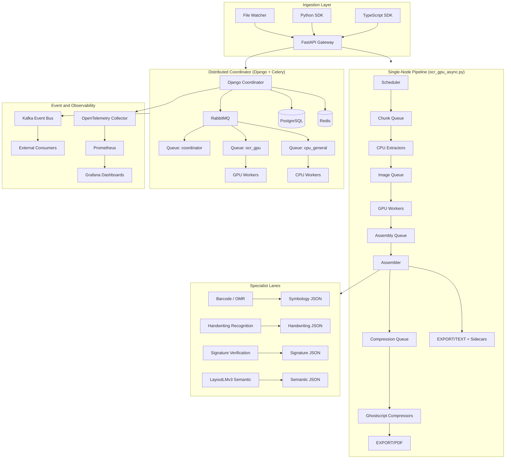

# 00: System Blueprint

## Mission Objective
`EDCOCR` converts source documents into searchable and auditable outputs with deterministic fallback behavior. The platform is designed for teams that need high-throughput OCR with forensic integrity, not best-effort text extraction.

## What This System Solves
- Converts PDFs and supported image formats into searchable PDFs and plain text.
- Preserves document evidence with image-only fallback when OCR fails.
- Supports adaptive language routing and optional enrichment modules.
- Scales from single-node Docker execution to distributed worker fleets.

## System Boundaries
| Boundary | In Scope | Out of Scope |
|---|---|---|
| OCR Processing | OCR, fallback, assembly, compression | Human document review workflows |
| Storage | Local folders (`ocr_source`, `ocr_output`, `ocr_temp`) and coordinator NFS paths | External object storage orchestration |
| APIs | Job submission/status APIs, WebSocket updates, webhook delivery | API gateway / WAF policy management |
| Scaling | Celery queues + worker orchestration | Kubernetes-native scheduler logic |
| Barcodes and OMR | Barcode extraction, checkbox detection, symbology outputs | Enterprise document intelligence suite |
| ML Training | LayoutLMv3 fine-tuning and calibration | General-purpose model training platform |
| Capability classes | Forensic-core processing plus optional AI-adjacent sidecars | Analyst conclusions, autonomous document reasoning |
| Observability | OpenTelemetry, Prometheus, Grafana, event bus | Full ELK/SIEM replacement |
| SDKs | Python and TypeScript client libraries | Additional language SDKs |

## Architecture Overview

## Core Execution Modes
| Mode | Entry Point | Typical Use |
|---|---|---|
| Monolithic Batch | `ocr_gpu_async.py` | Local high-throughput OCR in Docker |
| REST API | `api/main.py` | Programmatic submission and polling |
| Distributed | `coordinator/jobs/tasks.py` | Multi-worker scale-out processing |

## Boundary Contract

The system-level contract between forensic-core and optional AI-adjacent features is documented in [docs/architecture/forensic-ai-boundary-contract.md](architecture/forensic-ai-boundary-contract.md).

Practical rule:

- forensic-core owns OCR determinism, fallback, custody, validation, and primary PDF/TXT artifacts
- AI-adjacent features add optional sidecars, search indexes, or analyst-assist signals, but do not redefine the baseline forensic contract

## Artifact Contracts
| Artifact | Location | Producer |
|---|---|---|
| Searchable PDF | `ocr_output/EXPORT/PDF` | Assembler + compressor |
| Plain text | `ocr_output/EXPORT/TEXT` | Assembler |
| Structure JSON | `ocr_output/EXPORT/STRUCTURE` | Worker DocIntel path |
| NER JSON | `ocr_output/EXPORT/NER` | Assembler sidecar |
| Classification JSON | `ocr_output/EXPORT/CLASSIFICATION` | Assembler sidecar |
| Extraction JSON | `ocr_output/EXPORT/EXTRACTION` | Assembler sidecar |
| Validation JSON | `ocr_output/EXPORT/VALIDATION` | Assembler sidecar |
| Handwriting JSON | `ocr_output/EXPORT/HANDWRITING` | Assembler sidecar |
| Signature JSON | `ocr_output/EXPORT/SIGNATURE` | Assembler sidecar |
| Symbology JSON | `ocr_output/EXPORT/SYMBOLOGY` | Symbology orchestrator |
| Semantic JSON | `ocr_output/EXPORT/SEMANTIC` | LayoutLMv3 semantic path |
| Language JSON | `ocr_output/EXPORT/LANGUAGE` | Per-span language detection sidecar (opt-in, `ENABLE_PER_SPAN_LANGUAGE=true`; also produced by the re-detect CLI and `POST /api/v1/jobs/{id}/redetect-language`) |
| Failure audit | `ocr_output/failures.csv` | Pipeline error logging |

## Quality and Reliability Principles
1. Never discard source content: image-only fallback preserves unreadable pages.
2. Keep progress resumable: per-page temp artifacts support crash recovery.
3. Separate deliverables from diagnostics: failures are logged outside customer-facing artifacts.
4. Bound memory with queues: each stage communicates through bounded buffers.

> [!WARNING]
> The pipeline path model is container-first. `ocr_gpu_async.py` validates path roots against `/app/...` defaults. Treat Docker as the primary production path.

## Key Entry Points
| Layer | File |
|---|---|
| Monolithic pipeline | `ocr_gpu_async.py` |
| API app factory | `api/main.py` |
| API job orchestration | `api/job_manager.py` |
| Distributed orchestration | `coordinator/jobs/tasks.py` |
| Shared OCR utilities | `ocr_distributed/ocr_utils.py` |
| Barcode pipeline | `barcode_pipeline.py` |
| LayoutLMv3 training | `layoutlm_finetune.py` |
| Embedding service | `embedding_service.py` |
| File watcher | `file_watcher.py` |
| Transform / stamp CLI | `scripts/transform_stamp_cli.py` |
