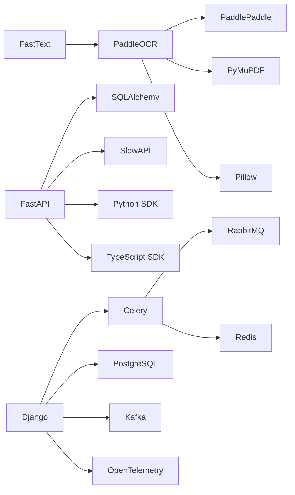

# 01: Tech Stack (DNA)

## Visual Stack

## Language and Runtime
| Category | Components |
|---|---|
| Primary language | Python |
| Runtime images | `python:3.10-slim` (pipeline), `python:3.11-slim` (coordinator) |
| GPU runtime dependency | NVIDIA Container Toolkit + CUDA-compatible drivers |

## OCR and Document Processing
| Area | Components | Role |
|---|---|---|
| Primary OCR | `paddleocr==2.9.1`, `paddlepaddle==2.6.2` | Main OCR engine and inference runtime |
| Fallback OCR | `pytesseract==0.3.13` + `tesseract-ocr` | Backup OCR path |
| PDF/image handling | `PyMuPDF==1.27.2.2`, `pdf2image==1.17.0`, `Pillow==12.1.1` | Rendering, merge, text layer insertion |
| Image preprocessing | `opencv-python-headless==4.11.0.86` | Deskew, denoise, binarize |
| Compression | `ghostscript` | Post-assembly PDF optimization |
| EasyOCR engine | `easyocr` | Handwriting-optimized OCR fallback |
| TrOCR recognition | `transformers` + `timm` | Optional handwriting recognition |
| Barcode extraction | `pyzbar`, `python-zxing` | Barcode and QR decoding |
| OMR detection | `opencv-python-headless` | Checkbox and radio mark detection |

## Language and Extraction Intelligence
| Area | Components | Role |
|---|---|---|
| Language detection | `fasttext==0.9.3` + `lid.176.bin` | OCR model routing |
| Named entities | `spacy==3.8.14` | Entity extraction (optional) |
| Structured extraction | `paddlenlp==2.8.1` | UIE field extraction (optional) |
| Rule-based extraction | Custom modules (`classification.py`, `extraction.py`, `ner.py`) | Deterministic enrichment |

## ML and NLP Intelligence
| Area | Components | Role |
|---|---|---|
| LayoutLMv3 | `transformers`, `peft`, `datasets`, `seqeval` | Token-level KIE with LoRA fine-tuning |
| Embeddings | `sentence-transformers` | Semantic search via dense vectors |
| Summarization | Built-in (TextRank) | Extractive, CTC-safe summarization |
| Confidence calibration | Built-in | Confidence scaling and thresholding |

## API Layer
| Area | Components | Role |
|---|---|---|
| HTTP API | `fastapi==0.135.2`, `uvicorn[standard]>=0.42.0,<1.0.0` | Job APIs and documentation UI |
| Persistence | `sqlalchemy==2.0.48` + SQLite (`jobs.db`) | Job state tracking |
| Throttling | `slowapi==0.1.9` | Request rate limiting |
| Realtime | `websockets>=16.0,<18.0` | Job progress stream |
| Webhooks | stdlib `urllib` + HMAC signing | Event delivery on terminal job states |

## Distributed Coordinator Layer
| Area | Components | Role |
|---|---|---|
| App framework | `Django==5.2` | Coordinator service and admin |
| Queue engine | `celery[rabbitmq]==5.6.3` | Task orchestration |
| Broker | RabbitMQ | Task transport |
| Result backend | Redis | Celery results and shared state |
| Relational state | PostgreSQL | Jobs, workers, page results, custody events |
| Monitoring | `flower==2.0.1` | Celery worker visibility |

## Infrastructure and Observability
| Area | Components | Role |
|---|---|---|
| Event streaming | `kafka-python` | Kafka event bus integration |
| Tracing | `opentelemetry-api`, `opentelemetry-sdk` | Distributed tracing |
| Metrics | Prometheus custom collector | ORM-backed metrics |
| Autoscaling | KEDA | Kubernetes event-driven autoscaling |
| Container orchestration | Helm | Kubernetes deployment charts |
| Cloud storage | `boto3`, `google-cloud-storage`, `azure-storage-blob` | Multi-cloud object storage |

## SDK Clients
| Area | Components | Role |
|---|---|---|
| Python SDK | `edcocr-sdk` | PyPI package for API integration |
| TypeScript SDK | `@edcocr/sdk` | npm package for Node.js/browser |

## Security and Credential Management
| Area | Components | Role |
|---|---|---|
| Credential management | `hvac` (Vault), `boto3` (KMS) | Production secret management |
| OAuth2 | `PyJWT`, `httpx` | OAuth2 provider support |
| SSRF protection | Built-in URL validation | Webhook and URL safety |

## Third-Party Models and External Endpoints
| Asset | Purpose | Acquisition Path |
|---|---|---|
| PaddleOCR language models | OCR model weights | Preloaded via `download_models.py` during build |
| FastText `lid.176.bin` | Language identification | Downloaded in Docker build |
| UIE model (`uie-base`/`uie-micro`) | Structured extraction | Downloaded when enabled |

## Dependency Topology

> [!TIP]
> Treat `requirements.txt`, `coordinator/requirements.txt`, and Docker manifests as the authoritative dependency source when upgrading versions.
