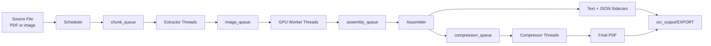
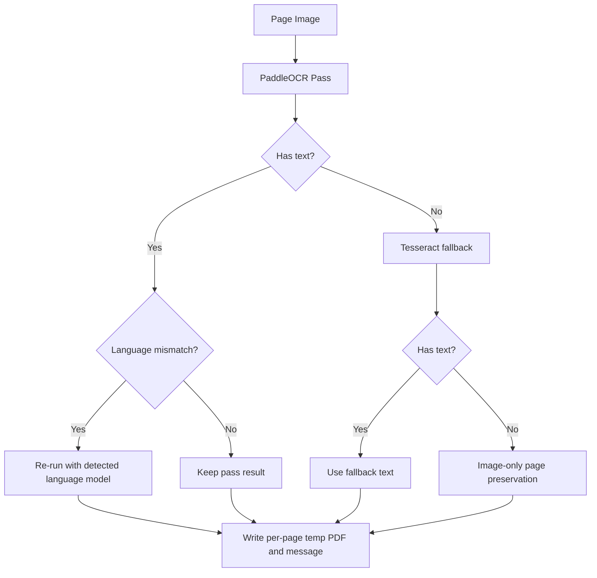
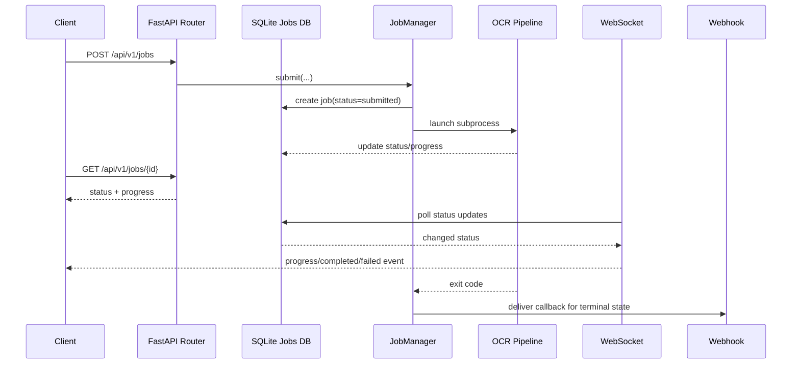
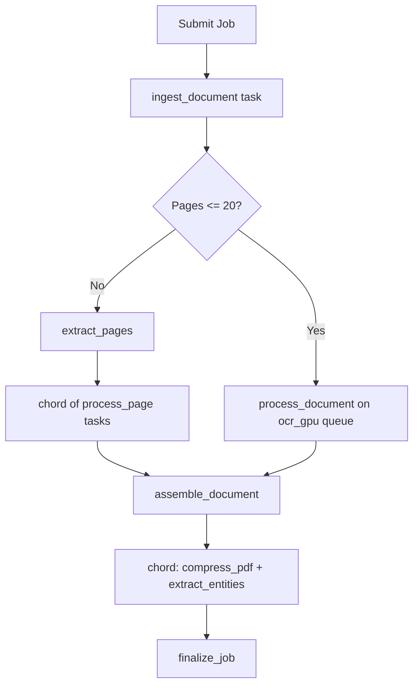
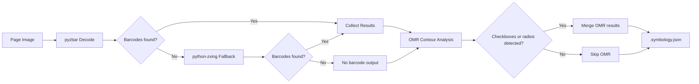
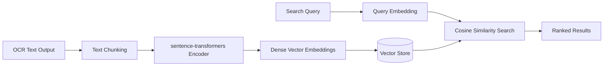
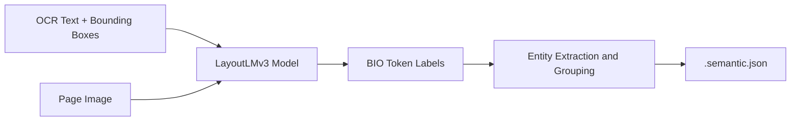
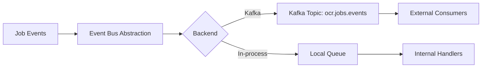
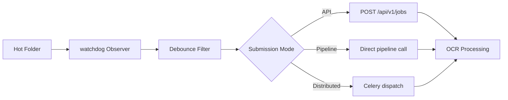
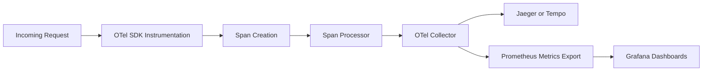

# 03: Information Flows

## End-to-End Processing Flow
The monolithic pipeline uses bounded queues to move data from source ingestion to final artifacts.

## Stage Narrative
| Stage | Input | Output | Primary Module |
|---|---|---|---|
| Scheduler | Source files in `SOURCE_FOLDER` | Page chunks + resume signals | `ocr_gpu_async.py` (`scheduler_thread`) |
| Extractors | Chunk metadata | PIL page images | `extractor_thread` |
| GPU workers | Page images | Per-page OCR results + temp PDFs | `worker_thread` |
| Assembler | Out-of-order page results | Ordered final document artifacts | `assembler_thread` |
| Compressors | Final PDF path | Optimized PDF | `compressor_thread` |
| Monitor | Queue and registry state | Throughput/health logs | `monitor_thread` |

## OCR Decision Flow

> [!NOTE]
> The system records failures in `failures.csv` while keeping deliverables clean.

## API Job Lifecycle Flow

## Distributed Flow (Coordinator Mode)

## Barcode and OMR Extraction Flow

## Semantic Search Flow

## LayoutLMv3 Extraction Flow

## Event Bus Flow

## File Watcher Ingestion Flow

## Distributed Tracing Flow

## API Surface (Operational Summary)
| Protocol | Endpoint | Purpose |
|---|---|---|
| REST | `POST /api/v1/jobs` | Submit job |
| REST | `GET /api/v1/jobs` | List jobs |
| REST | `GET /api/v1/jobs/{job_id}` | Poll job status |
| REST | `GET /api/v1/jobs/{job_id}/result` | Artifact metadata |
| REST | `GET /api/v1/jobs/{job_id}/result/download` | Artifact download |
| REST | `POST /api/v1/jobs/{job_id}/retry` | Retry failed/cancelled job |
| REST | `DELETE /api/v1/jobs/{job_id}` | Cancel job |
| REST | `GET /api/v1/health` | Health check |
| REST | `GET /api/v1/transforms` | List available transform operations |
| REST | `POST /api/v1/transforms/execute` | Execute transform operation |
| REST | `GET /api/v1/stamps` | List available stamp operations |
| REST | `POST /api/v1/stamps/execute` | Execute stamp operation |
| REST | `POST /api/v1/batch` | Submit batch of jobs |
| REST | `GET /api/v1/events` | Query job events |
| REST | `GET /api/v1/semantic/search` | Semantic search |
| REST | `GET /api/v1/fleet/status` | Worker fleet status |
| REST | `GET /api/v1/alerts` | Alert queries |
| REST | `GET /api/v1/analytics` | Processing analytics |
| REST | `GET /api/v1/dashboard` | Dashboard metrics |
| WebSocket | `/ws/jobs/{job_id}` | Realtime status updates |

## Data Contracts
| Contract | Location | Notes |
|---|---|---|
| Job record | SQLite (`api/database.py`) | Tracks status, timestamps, artifacts, webhook state |
| Page result | PostgreSQL (`coordinator/jobs/models.py`) | Distributed per-page tracking |
| Custody events | PostgreSQL + JSONL export | Hash-linked chain in distributed mode |
| Artifacts | `ocr_output/EXPORT/...` | Final deliverables and sidecars |
