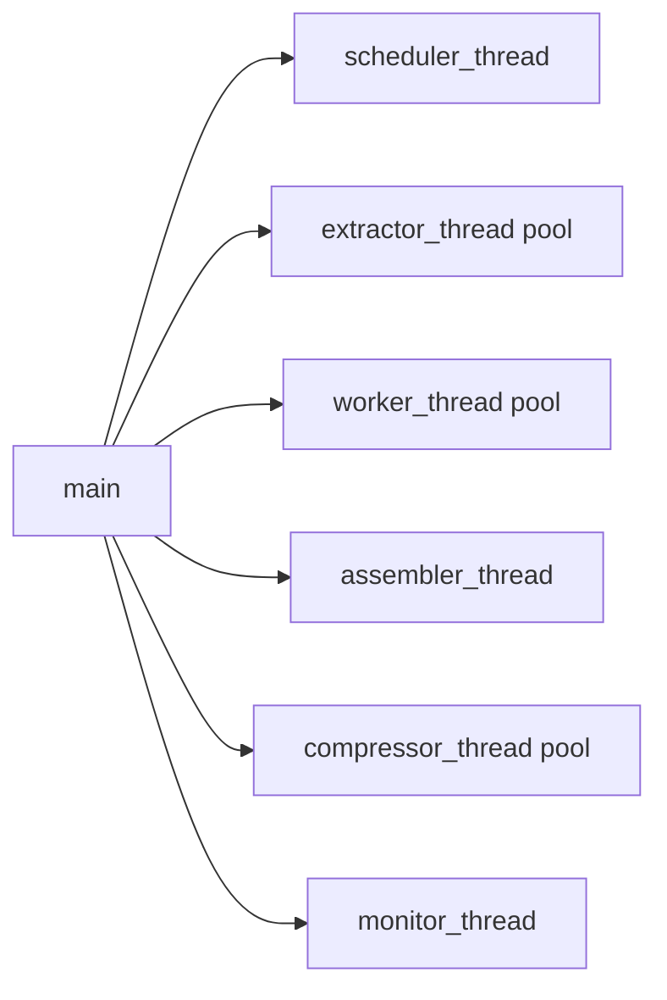

# 05: Interactive Walkthrough

## Tour Objective
This walkthrough helps a new contributor understand where work enters the system, how work moves, and where to instrument or modify behavior safely.

## Map the Entry Points
| Entry Type | File | Why It Matters |
|---|---|---|
| Pipeline runtime | `ocr_gpu_async.py` | Primary monolithic execution path |
| API app | `api/main.py` | FastAPI app assembly and middleware order |
| API orchestration | `api/job_manager.py` | Job lifecycle and subprocess launch |
| Distributed tasks | `coordinator/jobs/tasks.py` | Queue routing and fan-out/fan-in behavior |
| Shared OCR utilities | `ocr_distributed/ocr_utils.py` | Shared helpers across monolithic and distributed modes |

## Guided Tour: Monolithic Pipeline
### Stop 1: Bootstrap and config
Open `ocr_gpu_async.py` and inspect:
- `_safe_int` and `_safe_path` for environment handling.
- queue sizes and worker count defaults.
- feature flags for doc intelligence and sidecar modules.

### Stop 2: Core loops
The processing lifecycle is implemented by six functions:
1. `scheduler_thread`
2. `extractor_thread`
3. `worker_thread`
4. `assembler_thread`
5. `compressor_thread`
6. `monitor_thread`

Each stage communicates only through queues and status messages.

### Stop 3: Runtime orchestration
`main`:
- parses CLI flags
- starts all threads
- drains queues in order
- handles graceful shutdown with `SIGTERM` / `SIGINT`

## Guided Tour: API Path
### Stop 4: Request routing
Open:
- `api/routers/jobs.py`
- `api/routers/health.py`
- `api/routers/ws.py`

Observe:
- input validation
- job ID format enforcement
- rate limiting split between submit and read routes

### Stop 5: Job state machine
In `api/job_manager.py`, follow:
1. `submit` creates job record and starts background thread.
2. `_run_pipeline` launches pipeline subprocess and tracks return codes.
3. `_monitor_progress` polls output folder and updates `pages_completed`.
4. terminal states fire webhook delivery.

## Guided Tour: Distributed Path
### Stop 6: Task fan-out and fan-in
Open `coordinator/jobs/tasks.py`:
- `ingest_document` validates, hashes, and dispatches.
- `process_document` handles small documents in one task.
- `extract_pages` and `process_page` fan out large documents.
- `assemble_document` and `finalize_job` perform fan-in and completion.

### Stop 7: Worker lifecycle
Open `coordinator/jobs/signals.py` to see:
- worker auto-registration
- queue capability discovery
- heartbeat updates

## Guided Tour: Transform and Stamp Modules
### Stop 8: Transform and stamp entry points
Open the transform and stamp modules to understand post-OCR document modification:

**Core abstractions:**
- `ocr_distributed/transforms/base.py` — Transform operation contracts and validation
- `ocr_distributed/stamps/base.py` — Stamp operation contracts
- `ocr_distributed/stamps/zone.py` — Stamp placement + overlap detection helpers

**Built-in operations:**
- `ocr_distributed/transforms/pdf_ops.py` — PDF page operations (extract/delete/rotate/reorder/split/merge/insert)
- `ocr_distributed/transforms/image_ops.py` — PDF/image conversion operations
- `ocr_distributed/stamps/bates.py` — Bates numbering implementation
- `ocr_distributed/stamps/designation.py` — Confidentiality designation stamping

**API integration:**
- `api/routers/transforms.py` — Transform REST endpoints and feature flag enforcement
- `api/routers/stamps.py` — Stamp REST endpoints and validation gating

**Validation and custody integration:**
- `validation_gates.py` — `validate_transform_output` and `validate_stamp_output` functions
- `custody_hooks.py` — `record_transform_lifecycle` and `record_stamp_lifecycle` custody logging

Where to debug:
- **Validation failures**: inspect API `validation_gate_failed` error payloads or CLI JSON diagnostics
- **Custody diagnostics**: inspect `metadata.custody` in API responses and CLI result payloads
- **Operation execution**: run focused tests in `tests/test_api_transforms_stamps.py`, `tests/test_transform_stamp_cli.py`, and `tests/test_phase_f_*.py`

## Codebase Loop Landmarks
| Loop | Module | Observable Output |
|---|---|---|
| Scheduler scan loop | `ocr_gpu_async.py` | discovery logs, queue growth |
| Worker OCR loop | `ocr_gpu_async.py` | per-page OCR status, fallback messages |
| Assembler completion loop | `ocr_gpu_async.py` | final PDFs/text and sidecars |
| API polling loop | `api/routers/ws.py` | status events over WebSocket |
| Distributed heartbeat loop | `coordinator/jobs/signals.py` + periodic tasks | worker online/offline transitions |

> [!NOTE]
> When debugging throughput, start with queue depths and worker counts before tuning feature modules.

## First Contributions Checklist
1. Add or adjust one stage at a time.
2. Validate side effects in `ocr_output/EXPORT`.
3. Confirm fallback paths still preserve evidence.
4. Run focused tests under `tests/` and `coordinator/jobs/tests/`.
