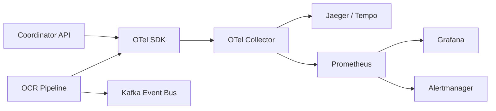

# 10: Monitoring and Operations

## Overview

EDCOCR includes comprehensive observability through Prometheus (metrics), Grafana (dashboards), OpenTelemetry (traces), PrometheusRule (alerts), and an optional Kafka event bus. Metrics come from two sources:

1. **Coordinator collector** (`coordinator/jobs/prometheus_metrics.py`) -- a custom Django ORM-backed collector that scrapes fleet-wide state from PostgreSQL. Exposed at `/api/v1/prometheus/` on the coordinator.
2. **API bridge collector** (`api/prometheus.py`) -- a per-process collector that exposes in-memory singletons (`dashboard`, `fleet_status`, `queue_alerting`, `sla_monitoring`, `cost_tracking`) as Prometheus gauges. Exposed at `/api/v1/prometheus/` on the FastAPI surface.

> [!NOTE]
> Every monitoring surface is opt-in via Helm values. Nothing is exposed to the public network by default.

---

## Observability Stack

---

## Metrics Endpoints

| Surface | Path | Auth | Notes |
|---|---|---|---|
| Coordinator JSON metrics | `GET /api/v1/metrics/` | `X-Api-Key` or `Authorization: Bearer` (`METRICS_API_KEY`) | Human-readable operational summary |
| Coordinator Prometheus scrape | `GET /api/v1/prometheus/` | Same as above | ORM-backed collector (7 metric families) |
| API Prometheus scrape | `GET /api/v1/prometheus/` | `X-API-Key` with role `admin`/`operator` | In-process singletons (throughput, fleet, SLA, cost) |
| Health probe | `GET /api/v1/health/detailed` | Open | Subsystem health for liveness/readiness |

> [!TIP]
> Always set `METRICS_API_KEY` in shared environments. Both `X-Api-Key` and `Authorization: Bearer` are accepted.

---

## Prometheus Metric Families

The coordinator collector emits 7 metric families (plus tenant and per-engine variants). The API bridge collector emits an additional group for real-time in-process observability.

### Coordinator Collector (`coordinator/jobs/prometheus_metrics.py`)

| Family | Type | Labels | Purpose |
|---|---|---|---|
| `ocr_jobs_total` | Gauge | `status` | Jobs by lifecycle status |
| `ocr_job_error_rate_1h` | Gauge | none | Rolling 1h failure rate (0.0 -- 1.0) |
| `ocr_workers_total` | Gauge | `status` | Workers by status (`online`, `busy`, `idle`, `offline`, ...) |
| `ocr_gpu_workers_available` | Gauge | none | GPU workers online or busy |
| `ocr_pages_processed_total` | Counter | `engine`, `status` | Pages processed per engine (`paddle`, `tesseract`, `onnx`) |
| `ocr_pages_by_status` | Gauge | `status` | Pages grouped by processing status |
| `ocr_pages_by_engine` | Gauge | `engine` | Pages per OCR engine |
| `ocr_page_processing_time_avg_ms` | Gauge | none | Average page processing time |
| `ocr_page_processing_time_p95_ms` | Gauge | none | 95th percentile processing time |
| `ocr_page_processing_time_p99_ms` | Gauge | none | 99th percentile processing time |
| `ocr_processing_duration_seconds` | Histogram | `status`, `engine`, `tenant_id` | Buckets: 0.5, 1, 2, 5, 10, 30, 60, 120, 300, 600 |
| `ocr_queue_depth` | Gauge | `queue` | Depth per pipeline stage (`extraction`, `ocr_gpu`, `ocr_cpu`, `compression`, `nlp`, `assembly`) |
| `ocr_dpi_escalation_total` | Gauge | none | Pages that needed DPI escalation retry |
| `ocr_custody_violations_total` | Gauge | none | Custody chain hash violations in the last hour |
| `ocr_s3_job_error_rate_1h` | Gauge | none | S3-backed job failure rate over the last hour |
| `ocr_job_completion_rate_1h` | Gauge | none | Rolling 1h completion rate |
| `ocr_jobs_by_storage_backend` | Gauge | `backend` | Jobs by storage backend (`nfs`, `s3`, `unset`) |
| `ocr_jobs_stuck_total` | Gauge | none | Jobs stuck in processing/ingesting over 1 hour |

Tenant-scoped variants (all gauges, labelled by `tenant_id`):

| Family | Labels | Purpose |
|---|---|---|
| `ocr_tenant_jobs_total` | `tenant_id`, `status` | Jobs per tenant by status |
| `ocr_tenant_pages_processed` | `tenant_id` | Total pages per tenant |
| `ocr_tenant_error_rate` | `tenant_id` | Per-tenant error rate (1h) |
| `ocr_tenant_processing_time_avg_ms` | `tenant_id` | Avg processing time per tenant |

### API Bridge Collector (`api/prometheus.py`)

| Family | Type | Labels | Purpose |
|---|---|---|---|
| `ocr_api_throughput_pages_per_minute` | Gauge | none | 5-minute rolling PPM |
| `ocr_api_throughput_docs_per_hour` | Gauge | none | 5-minute rolling DPH |
| `ocr_api_latency_ms` | Gauge | `percentile` (`p50`, `p95`, `p99`) | Processing latency |
| `ocr_api_stage_queue_depth` | Gauge | `stage` | Per-stage queue depth |
| `ocr_api_stage_active_workers` | Gauge | `stage` | Active workers per pipeline stage |
| `ocr_api_fleet_workers` | Gauge | `state` | Worker count per state |
| `ocr_api_fleet_gpu_utilization_pct` | Gauge | none | Fleet-wide GPU utilization |
| `ocr_api_queue_depth` | Gauge | `queue_name` | Per-queue depth (monitored set) |
| `ocr_api_queue_active_alerts` | Gauge | none | Active queue alerts |

Per-tenant SLA and cost gauges (bridge from `sla_monitoring.py` and `cost_tracking.py`):

| Family | Labels | Purpose |
|---|---|---|
| `ocr_sla_compliance_pct` | `tenant_id` | Overall SLA compliance percentage |
| `ocr_sla_violation_count` | `tenant_id` | Current violation count |
| `ocr_sla_availability_pct` | `tenant_id` | Current availability SLO |
| `ocr_sla_p95_latency_seconds` | `tenant_id` | Current P95 latency SLO |
| `ocr_cost_estimate_total` | `tenant_id` | Estimated cost in USD |
| `ocr_tenant_gpu_seconds` | `tenant_id` | GPU seconds consumed per tenant |
| `ocr_tenant_storage_bytes` | `tenant_id` | Storage bytes consumed per tenant |

---

## Grafana Dashboard

The Helm chart ships a 53-panel Grafana dashboard (`helm/ocr-local/templates/grafana-dashboard-configmap.yaml`) grouped by category rows. Enable it via `grafana.dashboard.enabled=true`.

> [!IMPORTANT]
> The panel count is asserted in multiple tests (`tests/test_grafana_panels_batch.py`, `test_p95_p99_panel.py`, `test_sla_breach_panel.py`, `test_tenant_metrics.py`, `test_prometheus_grafana_batch.py`). Update all five test files when adding or removing panels.

### Panel Groupings

| Row | Count | Panels |
|---|---|---|
| **Overview** | 4 | Job Error Rate, Completion Rate, GPU Workers Available, Pages Processed |
| **Jobs** | 4 | Jobs by Status, Jobs by Storage Backend, Stuck Jobs, Active OCR Alerts |
| **Workers and Pages** | 2 | Workers by Status, Pages by Status |
| **Storage and Compliance** | 3 | S3 Error Rate, Custody Violations, Error Rate Comparison (All vs S3) |
| **Performance** | 3 | Avg Page Processing Time, Page Processing Time Over Time, Completion Rate Over Time |
| **Baseline Monitoring** | 4 | Baseline Throughput (24h), Worker Utilization Ratio, Error Budget Burn Rate, Processing Time Distribution |
| **Advanced Performance** | 6 | Processing Time Percentiles, Queue Depth by Stage, DPI Escalation Rate, Pages by Engine, Processing Duration Heatmap, Processing Time P50/P95/P99, Processing Duration by Engine |
| **Tenant Overview** | 4 | Tenant Jobs by Status, Tenant Error Rate, Tenant Pages Processed, Tenant Avg Processing Time |
| **SLA Compliance** | 3 | SLA Compliance Rate, SLA Breach History, Processing Time p95/p99 |
| **Cost and Queue Analysis** | 3 | Cost per Tenant, Per-Tenant Processing Latency, Queue Depth per Stage |
| **Infrastructure** | 5 | CPU vs GPU Throughput, Storage Consumption, GPU VRAM Utilization, CPU vs GPU Pages by Engine, Tenant Storage Consumption |

(The remaining panels are category header rows used for grouping. The asserted total is 53.)

### Canary Monitoring Panels

A dedicated canary dashboard (opt-in via `grafana.canaryDashboard.enabled=true`) surfaces rollout-specific metrics:

- `ocr_canary_job_error_rate_1h`
- `ocr_canary_job_completion_rate_1h`
- `ocr_canary_processing_time_p95_ms`
- `ocr_canary_pages_processed_total`
- `ocr_canary_workers_online`

Canary alerts compare canary vs baseline and fire if error rate diverges >5% or completion rate drops >10%.

---

## Alert Rules

The Helm chart installs a `PrometheusRule` (`helm/ocr-local/templates/prometheusrule.yaml`) containing two groups: an `ocr-pipeline` group of alerts and an `ocr-recording-rules` group for rate smoothing.

### Pipeline Alerts

| Alert | Expression | Severity | For | Runbook |
|---|---|---|---|---|
| `OCRHighJobErrorRate` | `ocr_job_error_rate_1h > 0.1` | warning | 5m | [FAILOVER-RUNBOOK.md](FAILOVER-RUNBOOK.md) Section 5 |
| `OCRNoGPUWorkersAvailable` | `ocr_gpu_workers_available == 0` | critical | 2m | [FAILOVER-RUNBOOK.md](FAILOVER-RUNBOOK.md) Section 5 |
| `OCRWorkersDrained` | All workers offline | critical | 5m | [FAILOVER-RUNBOOK.md](FAILOVER-RUNBOOK.md) Section 5 |
| `OCRSlowPageProcessing` | `ocr_page_processing_time_avg_ms > 30000` | warning | 10m | [09-TROUBLESHOOTING.md](09-TROUBLESHOOTING.md) |
| `OCRJobsStuck` | Jobs processing but no page progress in 30m | warning | 30m | [FAILOVER-RUNBOOK.md](FAILOVER-RUNBOOK.md) Section 5 |
| `OCRCustodyChainViolation` | `ocr_custody_violations_total > 0` | critical | 1m | [FAILOVER-RUNBOOK.md](FAILOVER-RUNBOOK.md) Section 8 |
| `OCRHighS3ErrorRate` | `ocr_s3_job_error_rate_1h > 0.15` | warning | 5m | [09-TROUBLESHOOTING.md](09-TROUBLESHOOTING.md) (S3/MinIO) |
| `OCRLowCompletionRate` | `ocr_job_completion_rate_1h < 0.85` | warning | 10m | [FAILOVER-RUNBOOK.md](FAILOVER-RUNBOOK.md) Section 5 |
| `OCRJobTimeout` | `ocr_jobs_stuck_total > 0` | warning | 5m | [FAILOVER-RUNBOOK.md](FAILOVER-RUNBOOK.md) Section 5 |
| `OCRSLABreachRate` | P95 > 30s OR error rate > 1% | warning | 5m | [FAILOVER-RUNBOOK.md](FAILOVER-RUNBOOK.md) Section 7 |

### Recording Rules

Recording rules pre-aggregate expensive queries to stabilize dashboard performance and error-budget calculations:

| Record | Purpose |
|---|---|
| `ocr:error_rate:avg5m` / `avg15m` / `avg1h` | Smoothed error rate over multiple windows |
| `ocr:completion_rate:avg5m` / `avg15m` / `avg1h` | Smoothed completion rate |
| `ocr:s3_error_rate:avg5m` / `avg15m` | Smoothed S3 error rate |
| `ocr:worker_utilization_ratio` | `busy / total` workers |
| `ocr:gpu_worker_availability_ratio` | GPU workers available vs total online |
| `ocr:processing_time_avg:avg5m` / `avg15m` | Smoothed avg page processing time |
| `ocr:processing_time_p95:avg5m` / `avg15m` | Smoothed p95 |
| `ocr:processing_time_p99:avg5m` / `avg15m` | Smoothed p99 |
| `ocr:error_budget_burn_rate_1h` / `6h` / `24h` | Error budget burn rate vs 1% SLO |
| `ocr:error_budget_consumed_1h` | Error budget consumed in the last hour |
| `ocr:sla_compliance_rate` | Combined latency + error SLO compliance |

---

## Per-Tenant Metrics

### SLA Monitoring

Per-tenant SLOs are tracked by `sla_monitoring.py` and bridged to Prometheus via the API collector. Default SLOs:

- **Availability**: 99.0%
- **P95 latency**: 30s
- **Error rate**: <1%

Override per tenant via the SLA policy API (see `api/routers/sla.py`) or at process start via `SLA_DEFAULT_POLICY_JSON`.

Violations are written to a sliding window and exposed as:

- `ocr_sla_compliance_pct{tenant_id=...}`
- `ocr_sla_violation_count{tenant_id=...}`
- `ocr_sla_availability_pct{tenant_id=...}`
- `ocr_sla_p95_latency_seconds{tenant_id=...}`

Reports can be generated via `GET /api/v1/sla/reports/{tenant_id}`.

### Cost Tracking

Per-tenant resource usage is tracked in `cost_tracking.py` and bridged to Prometheus. Default rates are provider-agnostic and configurable via `COST_RATES_JSON`.

- `ocr_cost_estimate_total{tenant_id=...}`
- `ocr_tenant_gpu_seconds{tenant_id=...}`
- `ocr_tenant_storage_bytes{tenant_id=...}`

Breakdown reports include pages, GPU seconds, storage, and estimated USD cost.

---

## Kafka Event Bus

The optional Kafka event bus (`api/event_bus.py`) emits job lifecycle events for downstream consumers. Enable with `KAFKA_ENABLED=true` and a `KAFKA_BOOTSTRAP_SERVERS` list. Events mirror the webhook payload schema (see `docs/API-REFERENCE.md` Webhooks section).

---

## Operations Notes

- Use the Helm chart `ServiceMonitor` (`prometheus.serviceMonitor.enabled=true`) to scrape both coordinator and API endpoints.
- Protect `/api/v1/metrics/` and `/api/v1/prometheus/` with `METRICS_API_KEY` or `OCR_API_KEY` in shared environments.
- Keep OpenTelemetry trace sampling conservative in production unless actively debugging (1-5%).
- The monitor thread writes a heartbeat to `HEALTHCHECK_FILE` every 30 seconds; Docker healthchecks verify freshness.
- For failover and recovery procedures, see [FAILOVER-RUNBOOK.md](FAILOVER-RUNBOOK.md).
- For troubleshooting monitoring failures (KEDA, Sentinel, S3, LayoutLM), see [09-TROUBLESHOOTING.md](09-TROUBLESHOOTING.md).
