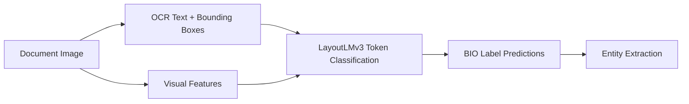
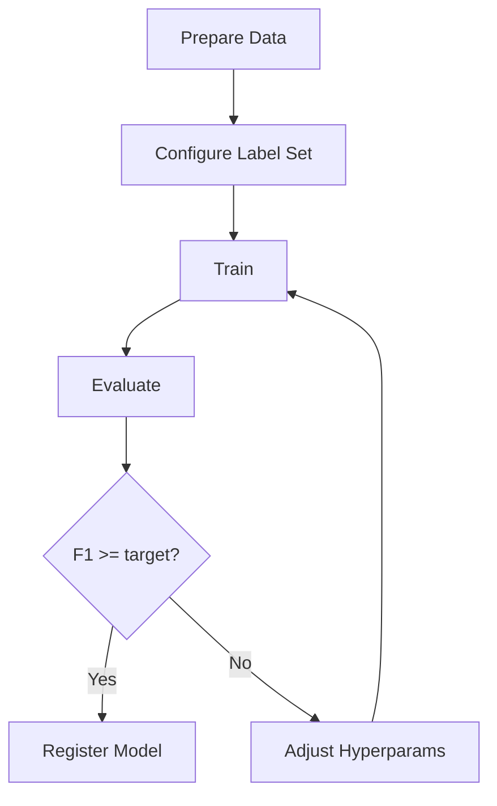

# 11: ML Training and Model Customization

## Overview

EDCOCR supports LayoutLMv3 fine-tuning for domain-specific document understanding. All ML functionality is CTC-safe and uses token classification rather than text generation.

> [!IMPORTANT]
> Heavy ML imports are lazy so the module can be imported without GPU dependencies.

---

## LayoutLMv3 Architecture

## Label Sets

| Label Set | Entities | Use Case |
|---|---|---|
| `default` | INVOICE_NUMBER, DATE, AMOUNT, PERSON_NAME, ORGANIZATION, ADDRESS | General business documents |
| `forensic` | Default + CASE_NUMBER, BATES_NUMBER, EXHIBIT_NUMBER, COURT_NAME | Legal and forensic documents |
| `receipt` | STORE_NAME, DATE, TOTAL, PAYMENT_METHOD | Receipts and invoices |
| `form` | FIELD_LABEL, FIELD_VALUE, CHECKBOX, SIGNATURE_FIELD | Structured forms |

## Training Data Format

Training data uses JSONL format with `text`, `boxes`, `labels`, and `image_path`.

## Fine-Tuning Workflow

## Evaluation and Registry

- Evaluate with entity-level precision, recall, and F1.
- Register the model with a versioned path when performance is acceptable.

## Confidence Calibration

Supported approaches include temperature scaling, Platt scaling, and isotonic calibration.
