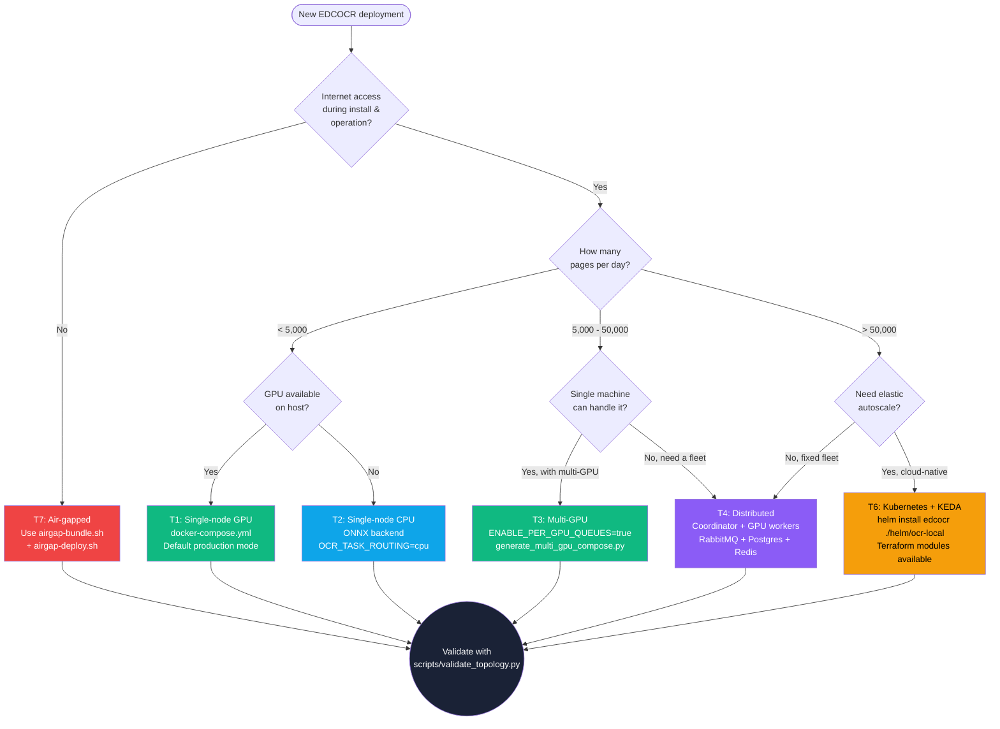
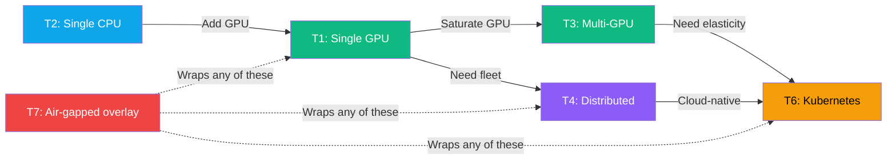

# EDCOCR — Deployment Decision Guide

**Version**: 4.1.0  ·  **Last Updated**: 2026-05-20

This guide walks you through choosing a deployment topology for EDCOCR. It is a
synthesis of `docs/operations/deployment-topology-matrix.md` (the full reference
matrix), `docs/cpu-vs-gpu-analysis.md` (the cost-and-throughput analysis), and
`docs/INSTALL.md` (the step-by-step install paths). Use this document **first**;
the others are deeper dives once you have made your decision.

---

## TL;DR

| If your situation is… | Start with… | Then graduate to… |
|---|---|---|
| One workstation, < 5k pages/day, GPU available | **T1 — Single-node GPU** | T3 (multi-GPU) when you saturate one card |
| One workstation, no GPU, < 500 pages/day | **T2 — Single-node CPU** | T1 (add GPU) when CPU latency hurts |
| Multiple machines, > 50k pages/day | **T4 — Distributed (Coordinator + GPU workers)** | T6 (Kubernetes) when you need autoscale |
| Regulated / cleared / air-gapped network | **T7 — Air-gapped** (bundled images) | Pair with T1, T4, or T6 as needed |
| Cloud-native, multi-region, elastic | **T6 — Kubernetes** with KEDA | Multi-cluster federation (custom) |
| Hybrid CPU+GPU fleet | **T5 — Distributed (CPU + GPU)** | T6 (Kubernetes) for orchestration |

---

## Decision Tree



---

## The Five Real Questions

### 1. Do you have internet access?

If your environment is **air-gapped or restricted** (SCIF, classified network,
disconnected enclave, regulated tenancy with no egress), choose **T7** as the
overlay first, then pick the underlying topology (T1, T4, T6) inside the air-gap.

EDCOCR pre-bundles 45 PaddleOCR language models, FastText LID models, and all
Python wheels in the worker image. Use `scripts/airgap-bundle.sh` on a connected
machine and `scripts/airgap-deploy.sh` on the disconnected target.

### 2. What is your sustained page-per-day volume?

The single most important capacity question.

| Pages / Day | Suggested Topology | Why |
|---|---|---|
| < 500 | T2 (CPU) | CPU-only is plenty; no GPU procurement needed |
| 500 - 5,000 | T1 (single GPU) | One mid-range GPU (e.g. RTX 3060 or A2000) saturates |
| 5,000 - 25,000 | T1 with high-end GPU **or** T3 multi-GPU | One A100/H100 or two RTX 4090s |
| 25,000 - 100,000 | T4 distributed | Multiple worker nodes, RabbitMQ + Postgres coordinator |
| > 100,000 | T6 Kubernetes + KEDA | Elastic autoscale on demand; quorum queues |

These bands assume the **default 6-stage pipeline** with PaddleOCR primary and
Tesseract fallback. Enabling optional sidecars (NER, classification, document
intelligence, translation) reduces effective throughput by 10-40% depending on
which sidecars are enabled.

### 3. Do you need elastic autoscale?

If your workload is **bursty** (e.g. 100k pages dropped overnight, then idle),
choose **T6 Kubernetes** with KEDA. The Helm chart at `helm/ocr-local/`
includes KEDA ScaledObjects for both GPU and CPU workers.

If your workload is **steady**, T4 (fixed worker fleet) is simpler to operate
and observe.

### 4. CPU-only or GPU-accelerated?

See `docs/cpu-vs-gpu-analysis.md` for the full cost breakdown. Quick summary:

- **GPU is faster per page** (typically 5-15x).
- **CPU is cheaper per machine** but you need more machines.
- **Break-even** is roughly at 2,500 pages/hour. Below that, CPU is more
  cost-effective. Above that, GPU wins.

EDCOCR supports both via the same code base. The ONNX Runtime backend
(`use_onnx=True`, set via `OCR_INFERENCE_BACKEND=onnx`) gives 4-7x CPU speedup
versus the native PaddlePaddle CPU backend.

### 5. Where will the data live?

| Storage Backend | Topology Fit | When to Use |
|---|---|---|
| Local filesystem | T1, T2 | Single-machine, small footprint |
| NFS | T3, T4 | Shared mount across multiple worker nodes |
| S3 / MinIO | T4, T6 | Object storage; required for true cloud-native |
| Hybrid (NFS + S3) | T4, T6 | Migration phase; `scripts/migrate_nfs_to_s3.py` |

S3 (or MinIO) is **required** for credential-free worker access via presigned
URLs. NFS is convenient for on-prem clusters but does not scale across regions.

---

## Topology Cheat Sheet

### T1 — Single-Node GPU (production default)

```bash
docker-compose up -d --build
```

- 1 container, all stages in-process
- Production for most users
- See `docs/02-QUICKSTART-5-MINUTE-SUCCESS.md`

### T2 — Single-Node CPU

```bash
OCR_TASK_ROUTING=cpu OCR_INFERENCE_BACKEND=onnx docker-compose up -d --build
```

- No GPU required
- 4-7x faster than native PaddlePaddle CPU backend
- See `docs/cpu-vs-gpu-analysis.md`

### T3 — Multi-GPU

```bash
python scripts/generate_multi_gpu_compose.py --num-gpus 4 --per-gpu-queues
docker-compose -f docker-compose.multi-gpu.yml up -d
```

- One worker per GPU, round-robin dispatch
- Set `ENABLE_PER_GPU_QUEUES=true` and `GPU_COUNT=N`

### T4 — Distributed (Coordinator + Workers)

```bash
# On coordinator host:
cd coordinator
docker-compose -f docker-compose.coordinator.yml up -d

# On each worker host:
docker-compose -f docker-compose.worker.yml up -d
```

- Django coordinator + Celery + RabbitMQ + Postgres + Redis
- Multiple worker hosts
- See `docs/architecture/pipeline-design.md`

### T6 — Kubernetes

```bash
helm install edcocr ./helm/ocr-local -f values-production.yaml
```

- Production cluster deployment
- KEDA autoscaling, PDBs, network policies, ServiceMonitor
- See `docs/operations/terraform-deployment-guide.md`
- 26 templates: coordinator, GPU workers, CPU workers, beat, Flower,
  Postgres, RabbitMQ, Redis (with Sentinel option), backup CronJobs

### T7 — Air-Gapped

```bash
# On connected host:
./scripts/airgap-bundle.sh --output edcocr-airgap-4.1.0.tar.gz

# On disconnected target:
./scripts/airgap-deploy.sh --bundle edcocr-airgap-4.1.0.tar.gz
```

- Pre-bundled images with 45 languages baked in
- Zero internet required
- Combines with T1, T4, T6 underneath

---

## Validation

After deploying, validate the topology with:

```bash
python scripts/validate_topology.py --topology T1 --report validation-report.md
```

The validator checks:
- Required containers running
- Required environment variables set
- Required ports listening
- Required volumes mounted
- Healthcheck endpoints returning 200
- Sample OCR job round-trip

For high-availability deployments, also run:

```bash
python scripts/ha_proof.py --report ha-report.md
```

This validates Redis Sentinel failover, RabbitMQ quorum-queue replication,
Postgres backup-restore, and worker reconnect-after-broker-restart.

---

## When to Change Topology

The migration paths that work cleanly:



Migrations to plan carefully:
- **T1 → T4**: Database migration from SQLite to PostgreSQL.
  See `docs/architecture/adr-sqlite-to-postgresql-migration.md`.
- **NFS → S3**: Use `scripts/migrate_nfs_to_s3.py --verify`. Supports resume.
- **CPU → GPU**: No data migration, just change `OCR_TASK_ROUTING` and add GPU
  to the worker host.

---

## See Also

- `docs/operations/deployment-topology-matrix.md` — Full per-topology env-var matrix
- `docs/cpu-vs-gpu-analysis.md` — Cost and throughput analysis
- `docs/INSTALL.md` — Step-by-step install for each path
- `docs/operations/production-cutover-runbook.md` — Pre-flight, cutover, rollback
- `docs/FAILOVER-RUNBOOK.md` — Component failover procedures

---

*Choose your topology carefully. Migrations are supported, but the cheapest
migration is the one you do not need to do.*
