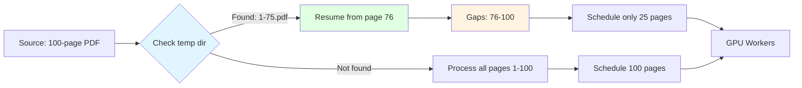
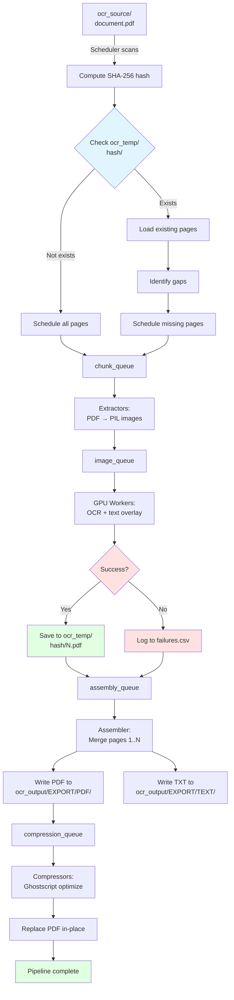

# Data Flow & Directory Structure

## Overview

The OCR pipeline implements a **structured directory hierarchy** with clear separation between input, temporary working state, and output artifacts. This design enables crash recovery, parallel processing, and clean organization of results.

---

## Directory Tree

```
./
│
├── ocr_source/                          # Input documents (recursively scanned)
│   ├── invoices/
│   │   ├── 2024-01-invoice.pdf
│   │   └── scan.tiff                   # Non-PDF sources
│   ├── contracts/
│   │   └── agreement.pdf
│   └── archive/
│       └── legacy/
│           └── old_document.pdf
│
├── ocr_temp/                            # Crash resume state (ephemeral)
│   ├── <doc_hash_1>/                   # SHA-256 hash of source file
│   │   ├── 1.pdf                       # Per-page OCR'd PDFs
│   │   ├── 2.pdf
│   │   ├── 3.pdf
│   │   └── ...
│   ├── <doc_hash_2>/
│   │   └── 1.pdf
│   └── ...
│
├── ocr_output/                          # Pipeline outputs
│   ├── EXPORT/
│   │   ├── PDF/                        # Mirrors ocr_source/ structure
│   │   │   ├── invoices/
│   │   │   │   ├── 2024-01-invoice.pdf
│   │   │   │   └── scan__tiff.pdf      # Extension token in stem
│   │   │   ├── contracts/
│   │   │   │   └── agreement.pdf
│   │   │   └── archive/
│   │   │       └── legacy/
│   │   │           └── old_document.pdf
│   │   │
│   │   └── TEXT/                       # Parallel text extraction
│   │       ├── invoices/
│   │       │   ├── 2024-01-invoice.txt
│   │       │   └── scan__tiff.txt
│   │       ├── contracts/
│   │       │   └── agreement.txt
│   │       └── archive/
│   │           └── legacy/
│   │               └── old_document.txt
│   │
│   ├── logs/
│   │   ├── ocr_pipeline_20240115_143022.log
│   │   └── ocr_pipeline_20240116_090511.log
│   │
│   └── failures.csv                    # Error audit log
│
├── models/                             # Pre-downloaded OCR models
│   ├── lid.176.bin                     # FastText language detection
│   └── paddleocr/                      # PaddleOCR models (27+ languages)
│
├── ocr_gpu_async.py                    # Main pipeline
├── download_models.py                  # Model preloader
├── optimize_pdfs.py                    # Standalone compression
└── ...
```

---

## Input: `ocr_source/`

### Discovery

The **Scheduler** performs a **recursive scan** of `ocr_source/` to discover all processable files.

```python
# Pseudocode from scheduler logic
for root, dirs, files in os.walk(SOURCE_FOLDER):
    for filename in files:
        full_path = os.path.join(root, filename)
        if is_supported_format(full_path):
            schedule_document(full_path)
```

### File Classification

**Two-stage validation** prevents processing of misnamed/corrupted files:

1. **Extension check**: `.pdf`, `.tiff`, `.jpg`, `.png`, etc.
2. **Magic bytes verification**: Reads first 12 bytes, matches against known signatures

```python
def detect_magic_family(filepath):
    magic_signatures = {
        b'%PDF': 'pdf',
        b'\xff\xd8\xff': 'jpeg',
        b'\x89PNG': 'png',
        b'II*\x00': 'tiff',  # Little-endian TIFF
        b'MM\x00*': 'tiff',  # Big-endian TIFF
        # ... 15+ more signatures
    }

    with open(filepath, 'rb') as f:
        header = f.read(12)
        for sig, family in magic_signatures.items:
            if header.startswith(sig):
                return family
    return None
```

**Rejection criteria**:
- Extension says `.pdf` but magic bytes are JPEG → **rejected** (security risk)
- Extension says `.jpg` but magic bytes are PDF → **rejected** (data integrity)

### Supported Formats

#### (Active)
- **PDF**: Primary format, direct page extraction
- **Images**: TIFF, JPEG, PNG, BMP, GIF, WebP, JPEG2000 (JP2/JPX), PNM, PBM, PGM, PPM, PCX, ICO, SVG

#### (Planned)
- **Next-gen images**: HEIC, AVIF, JPEG XL (JXL), JPEG XR (JXR)
- **Multi-page**: DCX (multi-page PCX)
- **Document**: XPS (XML Paper Specification)

---

## Temporary State: `ocr_temp/`

### Purpose

Stores **per-page OCR'd PDFs** during processing. Enables **crash resume** by preserving incremental progress.

### Directory Structure

```
ocr_temp/
└── <sha256_hash>/         # Unique per source file content
    ├── 1.pdf              # Page 1 (OCR complete)
    ├── 2.pdf              # Page 2 (OCR complete)
    ├── 3.pdf              # Page 3 (OCR complete)
    └── ...                # Missing page 4 → gap to re-process
```

### Hash Stability

```python
def compute_doc_hash(filepath):
    sha256 = hashlib.sha256
    with open(filepath, 'rb') as f:
        while chunk := f.read(8192):
            sha256.update(chunk)
    return sha256.hexdigest
```

**Benefits**:
- Same file content → same hash (even if renamed/moved)
- Different content → different hash (no collision risk)
- Resume works even after file relocation

### Resume Logic



### Lifecycle

1. **Creation**: First page OCR'd → `mkdir(ocr_temp/<hash>)`
2. **Growth**: Each page saved as `<page_num>.pdf`
3. **Cleanup**: After successful assembly → `rmtree(ocr_temp/<hash>)` (future enhancement)
4. **Persistence**: Currently **not deleted** (manual cleanup or disk quota management)

---

## Output: `ocr_output/`

### PDF: `ocr_output/EXPORT/PDF/`

**Structure**: Mirrors `ocr_source/` directory hierarchy exactly.

```
ocr_source/invoices/2024/january.pdf
    ↓
ocr_output/EXPORT/PDF/invoices/2024/january.pdf
```

**Content**:
- Searchable PDF with invisible text layer (render_mode=3)
- 300 DPI image quality preserved
- Ghostscript-optimized (prepress quality)

**Non-PDF Sources**: Filename includes **extension token** to prevent basename collisions.

```
ocr_source/photos/scan.tiff  →  ocr_output/EXPORT/PDF/photos/scan__tiff.pdf
ocr_source/photos/scan.jpg   →  ocr_output/EXPORT/PDF/photos/scan__jpg.pdf
```

**Why extension token?**
- `scan.tiff` and `scan.jpg` would both → `scan.pdf` (collision)
- Token prevents overwrite: `scan__tiff.pdf` vs `scan__jpg.pdf`

### TEXT: `ocr_output/EXPORT/TEXT/`

**Structure**: Parallel to PDF structure.

**Content**:
- Plain text extracted from OCR
- **Form-feed characters** (`\f`, ASCII 12) separate pages
- UTF-8 encoding

```
Page 1 text content here...
────────────────────────────
[ASCII form-feed: \f]
────────────────────────────
Page 2 text content here...
────────────────────────────
[ASCII form-feed: \f]
────────────────────────────
Page 3 text content here...
```

**Usage**:
- Full-text search indexing (Elasticsearch, Solr)
- Content extraction for NLP pipelines
- Diff/comparison tools

### Logs: `ocr_output/logs/`

**Filename**: `ocr_pipeline_<timestamp>.log`

**Format**:
```
2024-01-15 14:30:22 - INFO - Starting OCR pipeline
2024-01-15 14:30:23 - INFO - Scheduler: Found 145 documents
2024-01-15 14:30:33 - INFO - [MONITOR] Queues: C=12 I=87 A=234 G=5 | PPM: 45.2 (avg: 42.1) | Docs/hr: 18.3
2024-01-15 14:31:15 - ERROR - Page 47 of doc_abc123: Tesseract failed, using image-only
2024-01-15 14:45:00 - INFO - Pipeline complete. Total pages: 3,421 | Time: 14m 38s
```

**Levels**:
- `INFO`: Normal progress, monitor stats
- `WARNING`: Recoverable issues (fallback to Tesseract)
- `ERROR`: Page-level failures (logged to failures.csv)
- `CRITICAL`: Pipeline-level failures (unrecoverable)

### Failures: `ocr_output/failures.csv`

**Purpose**: Audit log for error analysis and retry logic.

**Schema**:
```csv
Timestamp,SourcePath,PageNum,Error
2024-01-15 14:31:15,/app/ocr_source/invoices/damaged.pdf,47,Tesseract OCR failed: timeout
2024-01-15 14:52:03,/app/ocr_source/scans/corrupt.tiff,1,PIL cannot identify image file
```

**Use cases**:
- Identify problematic documents for manual review
- Retry failed pages with different parameters
- Quality assurance reporting

---

## Document Lifecycle Flow



---

## Data Transformation Examples

### Example 1: PDF Input

```
INPUT:  ocr_source/contracts/2024/lease_agreement.pdf (25 pages)

TEMP:   ocr_temp/a3f5e8d.../1.pdf
        ocr_temp/a3f5e8d.../2.pdf
        ...
        ocr_temp/a3f5e8d.../25.pdf

OUTPUT: ocr_output/EXPORT/PDF/contracts/2024/lease_agreement.pdf
        ocr_output/EXPORT/TEXT/contracts/2024/lease_agreement.txt
```

### Example 2: TIFF Input

```
INPUT:  ocr_source/scans/archive/document.tiff (1 page)

TEMP:   ocr_temp/b8c2d9f.../1.pdf

OUTPUT: ocr_output/EXPORT/PDF/scans/archive/document__tiff.pdf
        ocr_output/EXPORT/TEXT/scans/archive/document__tiff.txt
```

### Example 3: Nested Directory

```
INPUT:  ocr_source/legal/2023/Q4/invoices/inv_001.pdf
        ocr_source/legal/2023/Q4/invoices/inv_002.pdf

OUTPUT: ocr_output/EXPORT/PDF/legal/2023/Q4/invoices/inv_001.pdf
        ocr_output/EXPORT/PDF/legal/2023/Q4/invoices/inv_002.pdf
        ocr_output/EXPORT/TEXT/legal/2023/Q4/invoices/inv_001.txt
        ocr_output/EXPORT/TEXT/legal/2023/Q4/invoices/inv_002.txt
```

**Directory structure preserved** → easy cross-referencing between source and output.

---

## Storage Requirements

### Disk Space Estimates

| Component | Size per Document | Notes |
|-----------|-------------------|-------|
| Source (ocr_source) | Varies | Original file size |
| Temp (ocr_temp) | 10-50 KB/page | Individual page PDFs |
| Output PDF | 80-120% of source | With text layer + optimization |
| Output TEXT | 1-5 KB/page | Plain text extraction |
| Logs | 100-500 bytes/page | Progress + errors |

**Example** (1,000 documents, avg 20 pages):
- Source: 50 GB
- Temp: 10-20 GB (cleaned after processing)
- Output PDF: 60 GB
- Output TEXT: 100 MB
- Logs: 10 MB

**Total**: ~120 GB (excluding temp cleanup)

### Cleanup Strategy

**Current** (manual):
```bash
# Remove temp files after pipeline complete
rm -rf ocr_temp/*
```

**Future** (automatic):
- Clean temp dir after successful assembly
- Configurable retention (keep last N days)
- Disk quota monitoring with auto-cleanup

---

## Security Considerations

### Magic Bytes Validation

**Threat**: Malicious file with `.pdf` extension but JPEG content (potential RCE via JPEG exploits)

**Mitigation**: Dual validation rejects extension/content mismatch

```python
if extension_family != magic_family:
    log.error(f"Signature mismatch: {filepath}")
    return None  # Skip file
```

### Path Traversal

**Threat**: Malicious filename with `../../../etc/passwd`

**Mitigation**: Output paths built via `os.path.join` with base folder validation

```python
# Relative path extraction
rel_path = os.path.relpath(source_path, SOURCE_FOLDER)
output_path = os.path.join(OUTPUT_FOLDER, 'EXPORT', 'PDF', rel_path)

# Still within output folder
assert output_path.startswith(OUTPUT_FOLDER)
```

### Temp Directory Isolation

**Benefit**: SHA-256 hash prevents collision attacks (birthday attack requires 2^128 operations)

---

## Monitoring & Observability

### Real-Time Metrics

```
[MONITOR] Queues: C=12 I=87 A=234 G=5 | PPM: 45.2 (avg: 42.1) | Docs/hr: 18.3
          │      │   │   │    │           │            │           │
          │      │   │   │    │           │            │           └─ Documents/hour
          │      │   │   │    │           │            └─ Average PPM (session)
          │      │   │   │    │           └─ Instantaneous pages/min
          │      │   │   │    └─ compression_queue depth
          │      │   │   └─ assembly_queue depth
          │      │   └─ image_queue depth
          │      └─ chunk_queue depth
```

### Log Correlation

```bash
# Find all errors for specific document
grep "doc_abc123" ocr_output/logs/*.log

# Track processing time for document
grep -A 5 "Starting document_name.pdf" ocr_output/logs/*.log
```

---

## Best Practices

### Input Organization

✅ **DO**: Use meaningful directory hierarchy in `ocr_source/`
```
ocr_source/
├── 2024/
│   ├── invoices/
│   └── contracts/
└── archive/
```

❌ **DON'T**: Dump all files in root
```
ocr_source/
├── file1.pdf
├── file2.pdf
├── ...
└── file9999.pdf
```

### Output Management

✅ **DO**: Periodically archive/compress output TEXT files (rarely accessed)

❌ **DON'T**: Let logs grow unbounded (set up log rotation)

### Temp Directory

✅ **DO**: Clean temp directory after successful runs

❌ **DON'T**: Assume temp files auto-delete (currently manual)

---

## Related Documentation

- **Pipeline Architecture**: `docs/architecture/pipeline-design.md`
- **Configuration**: `docs/06-CONFIGURATION-REFERENCE.md`
- **Docker Setup**: `docs/deployment/docker-guide.md`
