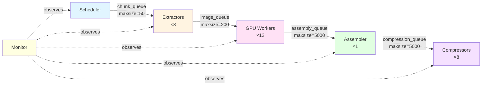
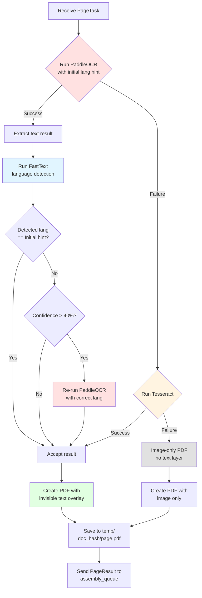
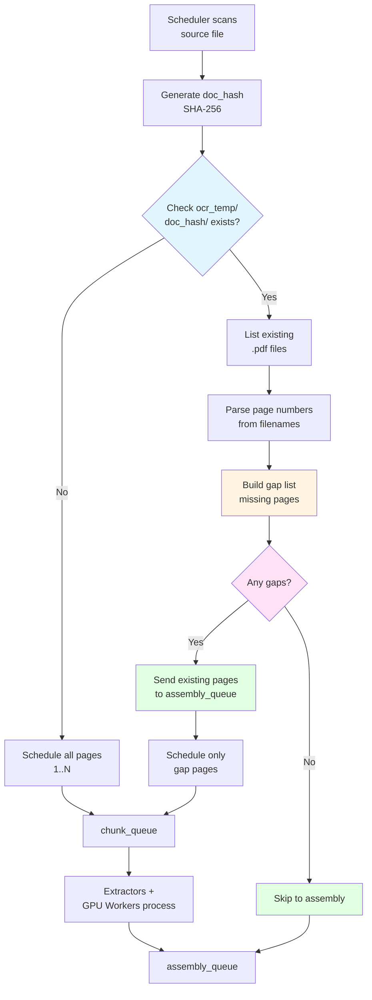
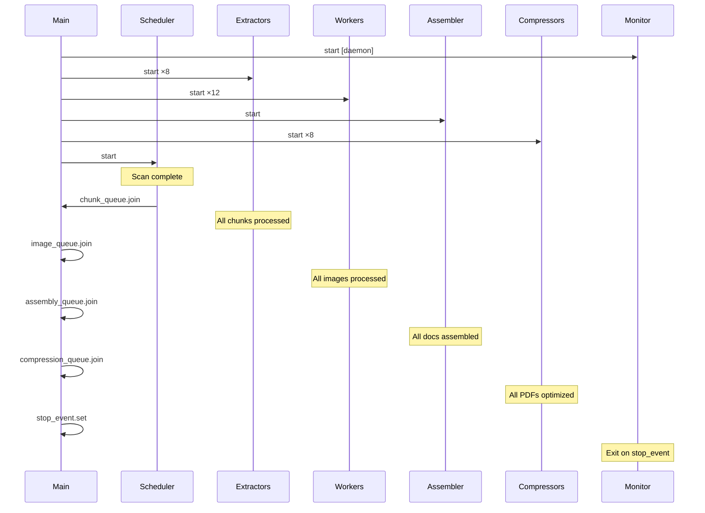

# Pipeline Architecture — EDCOCR

## Overview

The OCR pipeline implements a **6-stage asynchronous producer-consumer architecture** designed for industrial-scale document processing with GPU acceleration. The design prioritizes throughput, fault tolerance, and adaptive quality through intelligent fallback mechanisms.

## Architecture Principles

- **Asynchronous Parallelism**: Thread-safe queues decouple stages, enabling independent scaling
- **Crash Resume**: Page-level checkpointing via temp directory enables mid-document recovery
- **Adaptive Intelligence**: Two-pass language detection with automatic re-OCR
- **Quality Preservation**: 300 DPI processing with invisible text overlay (PDF render_mode=3)
- **Resource Efficiency**: Bounded queues prevent memory exhaustion

---

## Pipeline Stages

### Stage 1: Scheduler (1 thread)

**Responsibility**: Document discovery, classification, and chunk planning

**Process**:
1. Recursively scans `SOURCE_FOLDER` for documents
2. Classifies files via **dual validation**:
   - Extension check (`.pdf`, `.tiff`, `.jpg`, etc.)
   - Magic bytes verification (`detect_magic_family`)
   - Rejects signature mismatches for security
3. Generates stable **SHA-256 hash ID** per document
4. **Resume logic**: Checks `ocr_temp/<doc_hash>/` for existing `.pdf` pages
   - Builds list of missing pages (gaps)
   - Sends already-processed pages directly to `assembly_queue`
   - Only schedules missing pages for re-processing
5. Creates **gap-based chunks** (target: 20 pages per chunk)
6. Pushes chunks to `chunk_queue`

**Supported Formats**:
- PDF (primary)
- **** (active): TIFF, JPEG, PNG, BMP, GIF, WebP, JPEG2000, PNM, PBM, PGM, PPM, PCX, ICO, SVG
- **** (planned): HEIC, AVIF, JPEG XL, JPEG XR, DCX, XPS

**Output**: `DocumentState` objects with chunk metadata → `chunk_queue`

---

### Stage 2: Extractors (8 threads)

**Responsibility**: Rasterize documents to PIL images

**Process**:
- **For PDFs**: Uses `pdf2image` with Poppler backend at 300 DPI
- **For images**: Uses PIL with `fitz` (PyMuPDF) fallback
- Converts each page/image to PIL Image object
- Creates `PageTask` object (doc_id, page_num, image, metadata)
- Pushes to `image_queue`

**Concurrency**: `NUM_EXTRACTORS = 8` with `EXTRACTOR_MODE=thread` by default (optional `process` mode for CPU-heavy extraction workloads)

**Output**: `PageTask` objects → `image_queue`

---

### Stage 3: GPU Workers (12 threads)

**Responsibility**: Multi-tier OCR with adaptive language detection

**Three-Tier Fallback Chain**:

```
┌─────────────┐
│ PaddleOCR   │ ← Primary (PP-OCRv4)
│ (PP-OCRv4)  │
└──────┬──────┘
       │ ✓ Success
       ▼
┌─────────────────────┐
│ Language Detection  │ ← FastText analysis
│ (FastText)          │
└──────┬──────────────┘
       │
       ├─ Match → Continue
       │
       └─ Mismatch (>40% conf) → Re-run Paddle with correct language
                │
                ▼
       ┌────────────────┐
       │ Tesseract      │ ← Fallback if Paddle fails
       └────────┬───────┘
                │ ✗ Fail
                ▼
       ┌────────────────┐
       │ Image-Only PDF │ ← Last resort
       └────────────────┘
```

**Two-Pass Language Detection**:
1. Run PaddleOCR with initial language hint
2. Extract resulting text
3. Run FastText language detection on text
4. If detected language ≠ initial hint AND confidence > 40%:
   - **Re-run** PaddleOCR with correct language model
   - Use new results

**Text Overlay**:
- PDF render mode 3 (invisible text layer)
- Font size fitted to bounding box dimensions
- Preserves original image quality

**Per-Page Output**:
- Saves to `ocr_temp/<doc_hash>/<page_num>.pdf`
- Enables crash resume at page granularity

**Model Caching**:
- Per-thread model instances
- Thread-safe loading via `model_load_lock`

**Output**: `PageResult` objects → `assembly_queue`

---

### Stage 4: Assembler (1 thread)

**Responsibility**: Merge page PDFs into final document

**Process**:
1. Receives `PageResult` objects from GPU workers
2. Tracks **terminal pages** per document (last page marker)
3. Buffers results in `doc_registry` dictionary
4. When all pages (1..N) received:
   - Sorts pages in numerical order
   - Merges PDFs using PyMuPDF (fitz)
   - Writes to `ocr_output/EXPORT/PDF/`
   - Extracts text with form-feed (`\f`) page separators
   - Writes to `ocr_output/EXPORT/TEXT/`
   - Cleans up `doc_registry` entry (prevents memory leak)
   - Pushes final PDF path to `compression_queue`

**Why Single-Threaded**: Avoids complex locking around doc_registry mutations

**Output**: Merged PDFs → `compression_queue`, text files → disk

---

### Stage 5: Compressors (8 threads)

**Responsibility**: PDF optimization via Ghostscript

**Process**:
- Runs Ghostscript with `-dPDFSETTINGS=/prepress`
  - 300 DPI maximum quality
  - Preserves text layer
  - Optimizes image streams
- Replaces original file **in-place** (atomic rename)

**Concurrency**: `NUM_COMPRESSORS = 8` threads

**Output**: Optimized PDFs in `ocr_output/EXPORT/PDF/`

---

### Stage 6: Monitor (1 daemon thread)

**Responsibility**: Real-time pipeline health reporting

**Metrics** (logged every 10 seconds):
- Queue depths (all 4 queues)
- Instantaneous pages/minute (PPM)
- Average PPM (session lifetime)
- Documents/hour projection
- Per-document progress (pages completed/total)

**Output**: Timestamped log entries to console + log file

---

## Queue Architecture



### Queue Sizing Rationale

| Queue | Size | Rationale |
|-------|------|-----------|
| `chunk_queue` | 50 | Lightweight metadata, small buffer sufficient |
| `image_queue` | 200 | RAM-critical: ~200 × 20MB = 4GB max memory |
| `assembly_queue` | 5000 | Small PDFs, high throughput needs large buffer |
| `compression_queue` | 5000 | Decouple assembly from slow Ghostscript ops |

---

## GPU Worker OCR Decision Tree



---

## Resume Logic Flow



**Resume Benefits**:
- **Crash tolerance**: Power loss, OOM kills, ctrl+C → resume from last page
- **Incremental processing**: Add pages to existing PDF without re-OCR
- **Cost efficiency**: No wasted GPU cycles on already-processed pages

**Stability**: SHA-256 hash ensures same file always gets same temp directory, even if renamed/moved.

---

## Thread Lifecycle



**Join Cascade**: Each queue is drained before proceeding to next stage, ensuring clean shutdown.

---

## Performance Characteristics

### Throughput
- **Typical**: 60-120 pages/minute on 12-core GPU (RTX 3090/4090)
- **Bottleneck**: Usually GPU OCR stage (most time-consuming)
- **Scaling**: Linear with `NUM_WORKERS` up to GPU saturation

### Memory
- **Peak**: ~6-8 GB RAM (dominated by `image_queue` buffer)
- **Tuning**: Reduce `IMAGE_QUEUE_SIZE` if OOM occurs
- **Temp disk**: ~10-50 MB per document (cleaned on assembly)

### Fault Tolerance
- **Page-level resume**: No data loss on crash
- **Error isolation**: Failed pages logged to `failures.csv`, don't block document
- **Graceful degradation**: Tesseract/image-only fallbacks ensure progress

---

## Configuration Knobs

See `docs/06-CONFIGURATION-REFERENCE.md` for full parameter reference.

**Key tuning parameters**:
- `NUM_WORKERS`: Increase for more GPU parallelism (watch VRAM)
- `IMAGE_QUEUE_SIZE`: Decrease if RAM-limited
- `NUM_EXTRACTORS`: Increase if extraction is bottleneck (CPU-bound)
- `NUM_COMPRESSORS`: Match to available CPU cores

---

## Future Enhancements

- **Signal handling**: Graceful SIGTERM/SIGINT shutdown
- ****: HEIC, AVIF, JPEG XL support
- **Distributed processing**: Multi-GPU, multi-node scaling
- **Cloud storage**: S3/Azure Blob input/output
- **REST API**: HTTP interface for document submission
