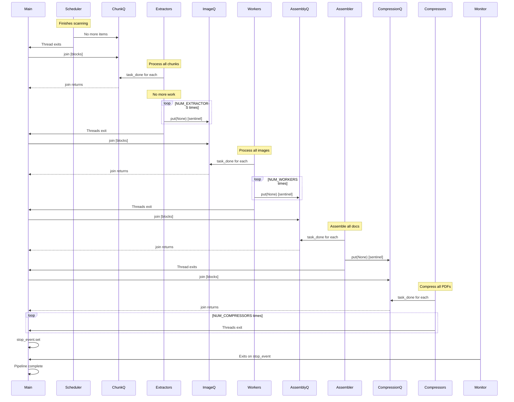

# Threading Model & Concurrency

## Overview

The OCR pipeline uses **Python threading by default** with a **queue-based producer-consumer pattern**. Extractors also support an opt-in **process mode** (`EXTRACTOR_MODE=process`) for CPU-heavy workloads.

---

## Architecture Decision: Threading vs Multiprocessing

### Why Threading?

| Consideration | Default Thread Mode | Extractor Process Mode |
|---------------|---------------------|-------------------------|
| **GIL Impact** | Minimal for GPU stage; moderate for extractors | Extractor GIL bypassed |
| **Memory Sharing** | Efficient shared memory | JPEG payload IPC overhead |
| **Debugging** | Single-process tracing | Multi-process diagnostics |
| **Startup Time** | Instant thread spawn | Process pool startup overhead |
| **Model Loading** | Shared in-memory models | OCR models still remain in main process threads |
| **Queue Overhead** | `queue.Queue` only | `queue.Queue` + process serialization |

**Key Insight**: GPU operations (PaddleOCR, Tesseract) release the GIL during CUDA/C++ execution. Thread mode is still preferred by default, but process mode is available when extractor CPU pressure is sustained.

### GIL Impact Analysis

```python
# Extractor stage (CPU-bound, GIL-limited)
image = convert_from_path(pdf_path, dpi=300)  # Poppler (C++) releases GIL
                                               # PIL operations hold GIL

# GPU Worker stage (GPU-bound, GIL-minimal)
result = paddle_ocr.ocr(image)  # PaddlePaddle (CUDA) releases GIL
                                 # Python list building holds GIL briefly

# Compressor stage (CPU-bound, GIL-released)
subprocess.run(['gs', ...])  # Ghostscript (external process) releases GIL
```

**Bottleneck**: Typically GPU OCR stage, not GIL contention.

---

## Thread Pool Architecture

### Thread Counts

```python
NUM_EXTRACTORS = 8      # PDF/image → PIL conversion
NUM_WORKERS = 12        # GPU OCR + text overlay
NUM_COMPRESSORS = 8     # Ghostscript optimization
EXTRACTOR_MODE = "thread"  # Optional: "process"
EXTRACTOR_PROCESS_WORKERS = NUM_EXTRACTORS

# Single-threaded stages
SCHEDULER = 1           # Document discovery
ASSEMBLER = 1           # PDF merging
MONITOR = 1             # Metrics logging (daemon)
```

**Total**: 31 threads (30 workers + 1 daemon)

### Scaling Guidelines

| Thread Pool | Scale By | Constraint |
|-------------|----------|------------|
| Extractors | CPU cores | GIL contention at >16 threads |
| GPU Workers | GPU VRAM | ~500-800 MB per worker (PaddleOCR) |
| Compressors | CPU cores | Ghostscript is CPU-bound |

**Example** (RTX 4090, 24GB VRAM, 16-core CPU):
- Extractors: 12 (75% of cores, leave headroom)
- GPU Workers: 16-20 (12-16 GB VRAM used)
- Compressors: 12 (match extractors)

---

## Queue-Based Communication

### Queue Specifications

```python
import queue

chunk_queue = queue.Queue(maxsize=50)         # Scheduler → Extractors
image_queue = queue.Queue(maxsize=200)        # Extractors → GPU Workers
assembly_queue = queue.Queue(maxsize=5000)    # GPU Workers → Assembler
compression_queue = queue.Queue(maxsize=5000) # Assembler → Compressors
```

### Queue Behavior

**Blocking Operations**:
```python
# Producer (blocks if full)
chunk_queue.put(chunk, block=True)  # Waits until space available

# Consumer (blocks if empty)
chunk = chunk_queue.get(block=True) # Waits until item available
```

**Backpressure**: Full queues naturally throttle producers, preventing memory exhaustion.

### Memory Estimation

```python
# image_queue: Most memory-intensive
image_size = 20 MB  # 300 DPI A4 page as PIL Image
queue_size = 200
total_ram = 200 * 20 MB = 4 GB

# assembly_queue: PDF pages
pdf_size = 50 KB  # Compressed per-page PDF
queue_size = 5000
total_ram = 5000 * 50 KB = 250 MB
```

**Tuning**: Reduce `IMAGE_QUEUE_SIZE` if OOM occurs (e.g., 100 → 2 GB RAM).

---

## Thread Lifecycle

### Initialization Sequence

```python
def main:
    # 1. Create queues (thread-safe by default)
    chunk_queue = queue.Queue(maxsize=50)
    # ... other queues

    # 2. Create synchronization primitives
    stop_event = threading.Event
    model_load_lock = threading.Lock

    # 3. Start daemon monitor first (observability)
    monitor_thread = threading.Thread(
        target=monitor_loop,
        args=(stop_event, chunk_queue, image_queue, ...),
        daemon=True  # Auto-exit when main threads finish
    )
    monitor_thread.start

    # 4. Start worker pools
    extractor_threads = [
        threading.Thread(target=extractor_worker, args=(chunk_queue, image_queue))
        for _ in range(NUM_EXTRACTORS)
    ]
    for t in extractor_threads:
        t.start

    # ... start GPU workers, assembler, compressors

    # 5. Start scheduler LAST (begins work)
    scheduler_thread = threading.Thread(
        target=scheduler_loop,
        args=(chunk_queue, ...)
    )
    scheduler_thread.start
```

### Join Cascade (Graceful Shutdown)



**Sentinel Values**: `None` signals "no more work" to consumer threads.

---

## Synchronization Primitives

### 1. Queue Task Tracking

```python
# Producer
chunk_queue.put(chunk)

# Consumer
chunk = chunk_queue.get
try:
    process(chunk)
finally:
    chunk_queue.task_done  # Signal completion

# Main thread
chunk_queue.join  # Block until all task_done called
```

**Purpose**: Ensures all items are processed before shutdown.

### 2. Model Load Lock

```python
model_load_lock = threading.Lock

def gpu_worker:
    global paddle_ocr

    if paddle_ocr is None:
        with model_load_lock:  # Only one thread loads
            if paddle_ocr is None:  # Double-check
                paddle_ocr = PaddleOCR(...)

    # Use model
    result = paddle_ocr.ocr(image)
```

**Purpose**: Prevents race condition during lazy model initialization.

**Why needed?**:
- PaddleOCR model loading is not thread-safe
- Multiple workers starting simultaneously could corrupt model state

**Performance**: Lock only held during initialization (~2 seconds), not during inference.

### 3. Stop Event

```python
stop_event = threading.Event

def monitor_loop(stop_event):
    while not stop_event.is_set:
        log_metrics
        time.sleep(10)

    print("Monitor exiting...")

# Main thread (after join cascade)
stop_event.set  # Signal monitor to exit
```

**Purpose**: Graceful daemon thread shutdown (no forced termination).

### 4. Document Registry

```python
doc_registry = {}  # Shared dictionary (not thread-safe!)
registry_lock = threading.Lock  # MISSING in current code

def assembler_worker:
    result = assembly_queue.get

    # UNSAFE: Multiple threads could access doc_registry
    # Should be:
    # with registry_lock:
    #     if result.doc_id not in doc_registry:
    #         doc_registry[result.doc_id] = []
    #     doc_registry[result.doc_id].append(result)

    # Current code relies on single assembler thread (safe by design)
    if result.doc_id not in doc_registry:
        doc_registry[result.doc_id] = []
    doc_registry[result.doc_id].append(result)
```

**Current Safety**: Single assembler thread = no race conditions.

**Future Risk**: If scaling to multiple assemblers, needs explicit locking.

---

## Thread Safety Analysis

### Thread-Safe Components

| Component | Safety Mechanism |
|-----------|------------------|
| `queue.Queue` | Built-in locks (put/get/task_done) |
| `threading.Event` | Built-in locks (set/is_set) |
| `threading.Lock` | Primitive lock |
| PIL Image objects | Not shared (owned by single thread) |
| PaddleOCR models | Per-thread instances (thread-local) |

### Thread-Unsafe Components (Mitigated)

| Component | Risk | Mitigation |
|-----------|------|------------|
| `doc_registry` dict | Race on insert/read | Single assembler thread |
| Model loading | Concurrent init | `model_load_lock` |
| File I/O (temp PDFs) | Concurrent write | Unique filenames (doc_hash/page_num.pdf) |
| Logging | Interleaved output | Python `logging` module is thread-safe |

---

## Memory Management

### PageTask Lifecycle

```python
class PageTask:
    def __init__(self, doc_id, page_num, image):
        self.image = image  # Large PIL Image (~20 MB)

# Extractor (producer)
task = PageTask(doc_id, page_num, image)
image_queue.put(task)
# Image still in memory (referenced by task)

# GPU Worker (consumer)
task = image_queue.get
result = process_ocr(task.image)
del task.image  # Explicit deletion (frees 20 MB)
task.image = None
```

**Memory leak prevention**: Explicitly delete large objects after use.

### Document Registry Cleanup

```python
def assembler_worker:
    # ... assemble all pages

    # Clean up after document complete
    del doc_registry[doc_id]  # Frees list of PageResult objects

    # Problem: doc_registry grows unbounded until pipeline ends
    # Future: Implement periodic cleanup of completed docs
```

**Current limitation**: Registry not cleaned until pipeline finishes (memory grows linearly with processed documents).

**Future fix**:
```python
if all_pages_assembled:
    merge_pdf(doc_registry[doc_id])
    del doc_registry[doc_id]  # Immediate cleanup
```

---

## Error Handling

### Per-Thread Exception Isolation

```python
def gpu_worker:
    while True:
        try:
            task = image_queue.get
            if task is None:  # Sentinel
                break

            result = process_page(task)
            assembly_queue.put(result)

        except Exception as e:
            # Log error but don't crash thread
            log.error(f"Page {task.page_num} failed: {e}")

            # Log to failures.csv
            with open(FAILURE_REPORT, 'a') as f:
                f.write(f"{timestamp},{task.doc_id},{task.page_num},{e}\n")

            # Continue processing other pages

        finally:
            image_queue.task_done
```

**Design principle**: Page-level failures don't stop the pipeline.

### Known Gaps

❌ **No signal handling**:
```python
# MISSING: SIGTERM/SIGINT handler
# User presses Ctrl+C → threads terminate mid-operation
# Temp files may be corrupted

# Future:
import signal

def signal_handler(sig, frame):
    log.info("Shutting down gracefully...")
    stop_event.set
    # Wait for joins...

signal.signal(signal.SIGINT, signal_handler)
signal.signal(signal.SIGTERM, signal_handler)
```

---

## Performance Characteristics

### Thread Startup Time

```python
import threading
import time

start = time.time
thread = threading.Thread(target=lambda: None)
thread.start
thread.join
print(f"Thread spawn: {time.time - start:.4f}s")  # ~0.001s
```

**Impact**: Negligible (30 threads start in <30ms).

### Context Switching Overhead

**With 30 threads**:
- Context switches: ~1,000/second (OS scheduler)
- Overhead: <1% CPU time
- Not a bottleneck (GPU wait time dominates)

### Queue Contention

**Scenario**: 12 GPU workers reading from `image_queue`

```python
# queue.Queue uses a single lock for get/put
# High contention if workers process very fast

# Measured impact:
# - Lock wait time: <0.1ms per operation
# - Throughput: 10,000+ ops/second
# - Not a bottleneck (OCR takes 100-500ms per page)
```

---

## Debugging & Monitoring

### Thread Inspection

```python
import threading

# List all threads
for thread in threading.enumerate:
    print(f"{thread.name}: alive={thread.is_alive}, daemon={thread.daemon}")

# Output:
# MainThread: alive=True, daemon=False
# Scheduler: alive=True, daemon=False
# Extractor-1: alive=True, daemon=False
# ...
# Monitor: alive=True, daemon=True
```

### Queue Depth Monitoring

```python
def monitor_loop:
    while not stop_event.is_set:
        print(f"Queues: C={chunk_queue.qsize} "
              f"I={image_queue.qsize} "
              f"A={assembly_queue.qsize} "
              f"G={compression_queue.qsize}")
        time.sleep(10)
```

**Interpretation**:
- High `chunk_queue`: Extractors are slow (CPU bottleneck)
- High `image_queue`: GPU workers are slow (GPU bottleneck)
- High `assembly_queue`: Assembler is slow (disk I/O bottleneck)
- High `compression_queue`: Compressors are slow (CPU bottleneck)

### Deadlock Detection

**Potential deadlock scenarios** (none currently present):

1. **Circular wait**: Thread A waits for lock X, Thread B waits for lock Y, both need both locks
   - **Mitigation**: Acquire locks in consistent order

2. **Queue deadlock**: Producer waits for consumer to free queue space, consumer waits for producer to signal completion
   - **Mitigation**: Use sentinels, ensure consumers always call `task_done`

3. **Join deadlock**: Main thread joins scheduler before scheduler finishes
   - **Mitigation**: Join in dependency order (scheduler → extractors → workers → ...)

---

## Best Practices

### ✅ DO

- Use `threading.Event` for signaling (not busy-wait loops)
- Call `queue.task_done` in `finally` blocks (ensures cleanup)
- Delete large objects explicitly after use
- Use thread-local storage for per-thread state
- Log thread names for debuggability

### ❌ DON'T

- Share mutable state without locks (race conditions)
- Use global variables without `threading.local`
- Forget sentinel values (threads will hang on `queue.get`)
- Ignore exceptions in worker threads (silent failures)
- Assume threads will terminate on Ctrl+C (add signal handlers)

---

## Future Enhancements

### 1. Multiprocessing Hybrid (Implemented, Opt-In)

```python
# Use multiprocessing for CPU-bound extractors
from multiprocessing import Process, Queue as MPQueue

extractor_queue = MPQueue
workers = [Process(target=extractor_worker) for _ in range(8)]

# Keep threading for GPU workers (model sharing)
```

**Benefit**: Bypass GIL for extractor stage when CPU contention is measurable.

**Cost**: IPC serialization overhead; use only when profiling indicates extractor bottlenecks.

### 2. AsyncIO Integration

```python
# Use asyncio for I/O-bound operations
async def scheduler:
    async for file in scan_directory_async:
        await chunk_queue.put(file)

# Keep threading for CPU/GPU-bound work
```

**Benefit**: Higher concurrency for file scanning.

**Cost**: Complexity of mixing asyncio + threading.

### 3. Thread Pool Executor

```python
from concurrent.futures import ThreadPoolExecutor

with ThreadPoolExecutor(max_workers=12) as executor:
    futures = [executor.submit(process_page, page) for page in pages]
    results = [f.result for f in futures]
```

**Benefit**: Simpler API, automatic exception handling.

**Cost**: Less control over queue depths, backpressure.

---

## Related Documentation

- **Pipeline Architecture**: `docs/architecture/pipeline-design.md`
- **Configuration Tuning**: `docs/06-CONFIGURATION-REFERENCE.md`
- **Monitoring Guide**: `docs/deployment/docker-guide.md` (logs section)
